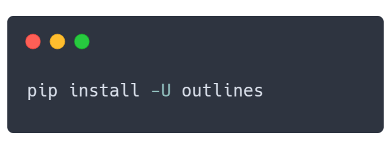
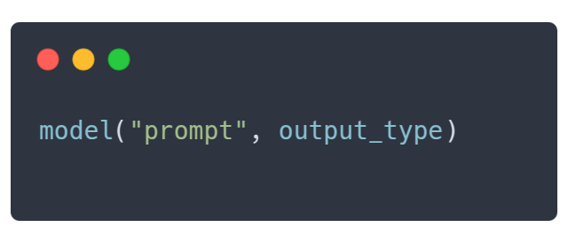

<div align="center" style="margin-bottom: 1em;">

</img>
</img>


 🗒️ *Structured outputs for LLMs* 🗒️

Made with ❤👷️ by the team at [.txt](https://dottxt.co)
<br>Trusted by NVIDIA, Cohere, HuggingFace, vLLM, etc.

<!-- Project Badges -->
[![PyPI Version][pypi-version-badge]][pypi]
[![Downloads][downloads-badge]][pypistats]
[![Stars][stars-badge]][stars]

<!-- Community Badges -->
[![Discord][discord-badge]][discord]
[![Blog][dottxt-blog-badge]][dottxt-blog]
[![Twitter][twitter-badge]][twitter]

</div>

Need a high-performance commercial solution for structured outputs? Email us at [contact@dottxt.co](mailto:contact@dottxt.co), or [schedule a call](https://cal.com/team/dottxt/sales).

## Table of Contents

- [Why Outlines?](#why-outlines)
- [Quickstart](#quickstart)
- [Real-World Examples](#real-world-examples)
  - [🙋‍♂️ Customer Support Triage](#customer-support-triage)
  - [📦 E-commerce Product Categorization](#e-commerce-product-categorization)
  - [📊 Parse Event Details with Incomplete Data](#parse-event-details-with-incomplete-data)
  - [🗂️ Categorize Documents into Predefined Types](#categorize-documents-into-predefined-types)
  - [📅 Schedule a Meeting with Function Calling](#schedule-a-meeting-with-function-calling)
  - [📝 Dynamically Generate Prompts with Re-usable Templates](#dynamically-generate-prompts-with-re-usable-templates)
- [They Use Outlines](#they-use-outlines)
- [Model Integrations](#model-integrations)
- [Core Features](#core-features)
- [Other Features](#other-features)
- [About .txt](#about-txt)
- [Community](#community)

<div align="center"></img></div>

## Why Outlines?

LLMs are powerful but their outputs are unpredictable. Most solutions attempt to fix bad outputs after generation using parsing, regex, or fragile code that breaks easily.

Outlines guarantees structured outputs during generation — directly from any LLM.

- **Works with any model** - Same code runs across OpenAI, Ollama, vLLM, and more
- **Simple integration** - Just pass your desired output type: `model(prompt, output_type)`
- **Guaranteed valid structure** - No more parsing headaches or broken JSON
- **Provider independence** - Switch models without changing code


### The Outlines Philosophy

<div align="center"></img></div>

Outlines follows a simple pattern that mirrors Python's own type system. Simply specify the desired output type, and Outlines will ensure your data matches that structure exactly:

- For a yes/no response, use `Literal["Yes", "No"]`
- For numerical values, use `int`
- For complex objects, define a structure with a [Pydantic model](https://docs.pydantic.dev/latest/)

## Quickstart

Getting started with outlines is simple:

### 1. Install outlines

``` shell
pip install outlines
```

### 2. Connect to your preferred model

``` python
import outlines
from transformers import AutoTokenizer, AutoModelForCausalLM


MODEL_NAME = "microsoft/Phi-3-mini-4k-instruct"
model = outlines.from_transformers(
    AutoModelForCausalLM.from_pretrained(MODEL_NAME, device_map="auto"),
    AutoTokenizer.from_pretrained(MODEL_NAME)
)
```

### 3. Start with simple structured outputs

``` python
from typing import Literal
from pydantic import BaseModel


# Simple classification
sentiment = model(
    "Analyze: 'This product completely changed my life!'",
    Literal["Positive", "Negative", "Neutral"]
)
print(sentiment)  # "Positive"

# Extract specific types
temperature = model("What's the boiling point of water in Celsius?", int)
print(temperature)  # 100
```

### 4. Create complex structures

``` python
from pydantic import BaseModel
from enum import Enum

class Rating(Enum):
    poor = 1
    fair = 2
    good = 3
    excellent = 4

class ProductReview(BaseModel):
    rating: Rating
    pros: list[str]
    cons: list[str]
    summary: str

review = model(
    "Review: The XPS 13 has great battery life and a stunning display, but it runs hot and the webcam is poor quality.",
    ProductReview,
    max_new_tokens=200,
)

review = ProductReview.model_validate_json(review)
print(f"Rating: {review.rating.name}")  # "Rating: good"
print(f"Pros: {review.pros}")           # "Pros: ['great battery life', 'stunning display']"
print(f"Summary: {review.summary}")     # "Summary: Good laptop with great display but thermal issues"
```

## Real-world examples

Here are production-ready examples showing how Outlines solves common problems:

<details id="customer-support-triage"><summary><b>🙋‍♂️ Customer Support Triage</b>
<br>This example shows how to convert a free-form customer email into a structured service ticket. By parsing attributes like priority, category, and escalation flags, the code enables automated routing and handling of support issues.
</summary>

``` python
import outlines
from enum import Enum
from pydantic import BaseModel
from transformers import AutoTokenizer, AutoModelForCausalLM
from typing import List


MODEL_NAME = "microsoft/Phi-3-mini-4k-instruct"
model = outlines.from_transformers(
    AutoModelForCausalLM.from_pretrained(MODEL_NAME, device_map="auto"),
    AutoTokenizer.from_pretrained(MODEL_NAME)
)


def alert_manager(ticket):
    print("Alert!", ticket)


class TicketPriority(str, Enum):
    low = "low"
    medium = "medium"
    high = "high"
    urgent = "urgent"

class ServiceTicket(BaseModel):
    priority: TicketPriority
    category: str
    requires_manager: bool
    summary: str
    action_items: List[str]


customer_email = """
Subject: URGENT - Cannot access my account after payment

I paid for the premium plan 3 hours ago and still can't access any features.
I've tried logging out and back in multiple times. This is unacceptable as I
have a client presentation in an hour and need the analytics dashboard.
Please fix this immediately or refund my payment.
"""

prompt = f"""
<|im_start|>user
Analyze this customer email:

{customer_email}
<|im_end|>
<|im_start|>assistant
"""

ticket = model(
    prompt,
    ServiceTicket,
    max_new_tokens=500
)

# Use structured data to route the ticket
ticket = ServiceTicket.model_validate_json(ticket)
if ticket.priority == "urgent" or ticket.requires_manager:
    alert_manager(ticket)
```
</details>

<details id="e-commerce-product-categorization"><summary><b>📦 E-commerce product categorization</b>
<br>This use case demonstrates how outlines can transform product descriptions into structured categorization data (e.g., main category, sub-category, and attributes) to streamline tasks such as inventory management. Each product description is processed automatically, reducing manual categorization overhead.
</summary>

```python
import outlines
from pydantic import BaseModel
from transformers import AutoTokenizer, AutoModelForCausalLM
from typing import List, Optional


MODEL_NAME = "microsoft/Phi-3-mini-4k-instruct"
model = outlines.from_transformers(
    AutoModelForCausalLM.from_pretrained(MODEL_NAME, device_map="auto"),
    AutoTokenizer.from_pretrained(MODEL_NAME)
)


def update_inventory(product, category, sub_category):
    print(f"Updated {product.split(',')[0]} in category {category}/{sub_category}")


class ProductCategory(BaseModel):
    main_category: str
    sub_category: str
    attributes: List[str]
    brand_match: Optional[str]

# Process product descriptions in batches
product_descriptions = [
    "Apple iPhone 15 Pro Max 256GB Titanium, 6.7-inch Super Retina XDR display with ProMotion",
    "Organic Cotton T-Shirt, Men's Medium, Navy Blue, 100% Sustainable Materials",
    "KitchenAid Stand Mixer, 5 Quart, Red, 10-Speed Settings with Dough Hook Attachment"
]

template = outlines.Template.from_string("""
<|im_start|>user
Categorize this product:

{{ description }}
<|im_end|>
<|im_start|>assistant
""")

# Get structured categorization for all products
categories = model(
    [template(description=desc) for desc in product_descriptions],
    ProductCategory,
    max_new_tokens=200
)

# Use categorization for inventory management
categories = [
    ProductCategory.model_validate_json(category) for category in categories
]
for product, category in zip(product_descriptions, categories):
    update_inventory(product, category.main_category, category.sub_category)
```
</details>

<details id="parse-event-details-with-incomplete-data"><summary><b>📊 Parse event details with incomplete data</b>
<br>This example uses outlines to parse event descriptions into structured information (like event name, date, location, type, and topics), even handling cases where the data is incomplete. It leverages union types to return either structured event data or a fallback “I don’t know” answer, ensuring robust extraction in varying scenarios.
</summary>

```python
import outlines
from typing import Union, List, Literal
from pydantic import BaseModel
from enum import Enum
from transformers import AutoTokenizer, AutoModelForCausalLM


MODEL_NAME = "microsoft/Phi-3-mini-4k-instruct"
model = outlines.from_transformers(
    AutoModelForCausalLM.from_pretrained(MODEL_NAME, device_map="auto"),
    AutoTokenizer.from_pretrained(MODEL_NAME)
)

class EventType(str, Enum):
    conference = "conference"
    webinar = "webinar"
    workshop = "workshop"
    meetup = "meetup"
    other = "other"


class EventInfo(BaseModel):
    """Structured information about a tech event"""
    name: str
    date: str
    location: str
    event_type: EventType
    topics: List[str]
    registration_required: bool

# Create a union type that can either be a structured EventInfo or "I don't know"
EventResponse = Union[EventInfo, Literal["I don't know"]]

# Sample event descriptions
event_descriptions = [
    # Complete information
    """
    Join us for DevCon 2023, the premier developer conference happening on November 15-17, 2023
    at the San Francisco Convention Center. Topics include AI/ML, cloud infrastructure, and web3.
    Registration is required.
    """,

    # Insufficient information
    """
    Tech event next week. More details coming soon!
    """
]

# Process events
results = []
for description in event_descriptions:
    prompt = f"""
<|im_start>system
You are a helpful assistant
<|im_end|>
<|im_start>user
Extract structured information about this tech event:

{description}

If there is enough information, return a JSON object with the following fields:

- name: The name of the event
- date: The date where the event is taking place
- location: Where the event is taking place
- event_type: either 'conference', 'webinar', 'workshop', 'meetup' or 'other'
- topics: a list of topics of the conference
- registration_required: a boolean that indicates whether registration is required

If the information available does not allow you to fill this JSON, and only then, answer 'I don't know'.
<|im_end|>
<|im_start|>assistant
"""
    # Union type allows the model to return structured data or "I don't know"
    result = model(prompt, EventResponse, max_new_tokens=200)
    results.append(result)

# Display results
for i, result in enumerate(results):
    print(f"Event {i+1}:")
    if isinstance(result, str):
        print(f"  {result}")
    else:
        # It's an EventInfo object
        print(f"  Name: {result.name}")
        print(f"  Type: {result.event_type}")
        print(f"  Date: {result.date}")
        print(f"  Topics: {', '.join(result.topics)}")
    print()

# Use structured data in downstream processing
structured_count = sum(1 for r in results if isinstance(r, EventInfo))
print(f"Successfully extracted data for {structured_count} of {len(results)} events")
```
</details>

<details id="categorize-documents-into-predefined-types"><summary><b>🗂️ Categorize documents into predefined types</b>
<br>In this case, outlines classifies documents into predefined categories (e.g., “Financial Report,” “Legal Contract”) using a literal type specification. The resulting classifications are displayed in both a table format and through a category distribution summary, illustrating how structured outputs can simplify content management.
</summary>

```python
import outlines
from typing import Literal, List
import pandas as pd
from transformers import AutoTokenizer, AutoModelForCausalLM


MODEL_NAME = "microsoft/Phi-3-mini-4k-instruct"
model = outlines.from_transformers(
    AutoModelForCausalLM.from_pretrained(MODEL_NAME, device_map="auto"),
    AutoTokenizer.from_pretrained(MODEL_NAME)
)


# Define classification categories using Literal
DocumentCategory = Literal[
    "Financial Report",
    "Legal Contract",
    "Technical Documentation",
    "Marketing Material",
    "Personal Correspondence"
]

# Sample documents to classify
documents = [
    "Q3 Financial Summary: Revenue increased by 15% year-over-year to $12.4M. EBITDA margin improved to 23% compared to 19% in Q3 last year. Operating expenses...",

    "This agreement is made between Party A and Party B, hereinafter referred to as 'the Parties', on this day of...",

    "The API accepts POST requests with JSON payloads. Required parameters include 'user_id' and 'transaction_type'. The endpoint returns a 200 status code on success."
]

template = outlines.Template.from_string("""
<|im_start|>user
Classify the following document into exactly one category among the following categories:
- Financial Report
- Legal Contract
- Technical Documentation
- Marketing Material
- Personal Correspondence

Document:
{{ document }}
<|im_end|>
<|im_start|>assistant
""")

# Classify documents
def classify_documents(texts: List[str]) -> List[DocumentCategory]:
    results = []

    for text in texts:
        prompt = template(document=text)
        # The model must return one of the predefined categories
        category = model(prompt, DocumentCategory, max_new_tokens=200)
        results.append(category)

    return results

# Perform classification
classifications = classify_documents(documents)

# Create a simple results table
results_df = pd.DataFrame({
    "Document": [doc[:50] + "..." for doc in documents],
    "Classification": classifications
})

print(results_df)

# Count documents by category
category_counts = pd.Series(classifications).value_counts()
print("\nCategory Distribution:")
print(category_counts)
```
</details>

<details>
<summary id="schedule-a-meeting-with-function-calling"><b>📅 Schedule a meeting from requests with Function Calling</b>
<br>This example demonstrates how outlines can interpret a natural language meeting request and translate it into a structured format matching a predefined function’s parameters. Once the meeting details are extracted (e.g., title, date, duration, attendees), they are used to automatically schedule the meeting.
</summary>

```python
import outlines
import json
from typing import List, Optional
from datetime import date
from transformers import AutoTokenizer, AutoModelForCausalLM


MODEL_NAME = "microsoft/phi-4"
model = outlines.from_transformers(
    AutoModelForCausalLM.from_pretrained(MODEL_NAME, device_map="auto"),
    AutoTokenizer.from_pretrained(MODEL_NAME)
)


# Define a function with typed parameters
def schedule_meeting(
    title: str,
    date: date,
    duration_minutes: int,
    attendees: List[str],
    location: Optional[str] = None,
    agenda_items: Optional[List[str]] = None
):
    """Schedule a meeting with the specified details"""
    # In a real app, this would create the meeting
    meeting = {
        "title": title,
        "date": date,
        "duration_minutes": duration_minutes,
        "attendees": attendees,
        "location": location,
        "agenda_items": agenda_items
    }
    return f"Meeting '{title}' scheduled for {date} with {len(attendees)} attendees"

# Natural language request
user_request = """
I need to set up a product roadmap review with the engineering team for next
Tuesday at 2pm. It should last 90 minutes. Please invite john@example.com,
sarah@example.com, and the product team at product@example.com.
"""

# Outlines automatically infers the required structure from the function signature
prompt = f"""
<|im_start|>user
Extract the meeting details from this request:

{user_request}
<|im_end|>
<|im_start|>assistant
"""
meeting_params = model(prompt, schedule_meeting, max_new_tokens=200)

# The result is a dictionary matching the function parameters
meeting_params = json.loads(meeting_params)
print(meeting_params)

# Call the function with the extracted parameters
result = schedule_meeting(**meeting_params)
print(result)
# "Meeting 'Product Roadmap Review' scheduled for 2023-10-17 with 3 attendees"
```
</details>

<details>
<summary id="dynamically-generate-prompts-with-re-usable-templates"><b>📝 Dynamically generate prompts with re-usable templates</b>
<br>Using Jinja-based templates, this example shows how to generate dynamic prompts for tasks like sentiment analysis. It illustrates how to easily re-use and customize prompts—including few-shot learning strategies—for different content types while ensuring the outputs remain structured.
</summary>

```python
import outlines
from typing import List, Literal
from transformers import AutoTokenizer, AutoModelForCausalLM


MODEL_NAME = "microsoft/phi-4"
model = outlines.from_transformers(
    AutoModelForCausalLM.from_pretrained(MODEL_NAME, device_map="auto"),
    AutoTokenizer.from_pretrained(MODEL_NAME)
)


# 1. Create a reusable template with Jinja syntax
sentiment_template = outlines.Template.from_string("""
<|im_start>user
Analyze the sentiment of the following {{ content_type }}:

{{ text }}

Provide your analysis as either "Positive", "Negative", or "Neutral".
<|im_end>
<|im_start>assistant
""")

# 2. Generate prompts with different parameters
review = "This restaurant exceeded all my expectations. Fantastic service!"
prompt = sentiment_template(content_type="review", text=review)

# 3. Use the templated prompt with structured generation
result = model(prompt, Literal["Positive", "Negative", "Neutral"])
print(result)  # "Positive"

# Templates can also be loaded from files
example_template = outlines.Template.from_file("templates/few_shot.txt")

# Use with examples for few-shot learning
examples = [
    ("The food was cold", "Negative"),
    ("The staff was friendly", "Positive")
]
few_shot_prompt = example_template(examples=examples, query="Service was slow")
print(few_shot_prompt)
```
</details>

## They use outlines

<div align="center">
</img>
</img>
</div>

## Model Integrations

| Model type | Description | Documentation |
|---------|-------------|:-------------:|
| **Server Support** | vLLM and Ollama | [Server Integrations →](https://dottxt-ai.github.io/outlines/latest/features/models/) |
| **Local Model Support** | transformers and llama.cpp | [Model Integrations →](https://dottxt-ai.github.io/outlines/latest/features/models/) |
| **API Support** | OpenAI and Gemini | [API Integrations →](https://dottxt-ai.github.io/outlines/latest/features/models/) |

## Core Features

| Feature | Description | Documentation |
|---------|-------------|:-------------:|
| **Multiple Choices** | Constrain outputs to predefined options | [Multiple Choices Guide →](https://dottxt-ai.github.io/outlines/latest/features/core/output_types/#multiple-choices) |
| **Function Calls** | Infer structure from function signatures | [Function Guide →](https://dottxt-ai.github.io/outlines/latest/features/core/output_types/#json-schemas) |
| **JSON/Pydantic** | Generate outputs matching JSON schemas | [JSON Guide →](https://dottxt-ai.github.io/outlines/latest/features/core/output_types/#json-schemas) |
| **Regular Expressions** | Generate text following a regex pattern | [Regex Guide →](https://dottxt-ai.github.io/outlines/latest/features/core/output_types/#regex-patterns) |
| **Grammars** | Enforce complex output structures | [Grammar Guide →](https://dottxt-ai.github.io/outlines/latest/features/core/output_types/#context-free-grammars) |

## Other Features

| Feature | Description | Documentation |
|---------|-------------|:-------------:|
| **Prompt templates** | Separate complex prompts from code | [Template Guide →](https://dottxt-ai.github.io/outlines/latest/features/utility/template/) |
| **Custome types** | Intuitive interface to build complex types | [Python Types Guide →](https://dottxt-ai.github.io/outlines/latest/features/core/output_types/#basic-python-types) |
| **Applications** | Encapsulate templates and types into functions | [Application Guide →](https://dottxt-ai.github.io/outlines/latest/features/utility/application/) |

## About .txt

<div align="center">
</img>
</img>
</div>

Outlines is developed and maintained by [.txt](https://dottxt.co), a company dedicated to making LLMs more reliable for production applications.

Our focus is on advancing structured generation technology through:

- 🧪 **Cutting-edge Research**: We publish our findings on [structured generation](http://blog.dottxt.co/performance-gsm8k.html)
- 🚀 **Enterprise-grade solutions**: You can license [our enterprise-grade libraries](https://docs.dottxt.co).
- 🧩 **Open Source Collaboration**: We believe in building in public and contributing to the community

Follow us on [Twitter](https://twitter.com/dottxtai) or check out our [blog](https://blog.dottxt.co/) to stay updated on our latest work in making LLMs more reliable.

## Community

<div align="center" style="margin-bottom: 1em;">

[![Contributors][contributors-badge]][contributors]
[![Stars][stars-badge]][stars]
[![Downloads][downloads-badge]][pypistats]
[![Discord badge][discord-badge]][discord]

</div>

- 💡 **Have an idea?** Come chat with us on [Discord][discord]
- 🐞 **Found a bug?** Open an [issue](https://github.com/dottxt-ai/outlines/issues)
- 🧩  **Want to contribute?** Consult our [contribution guide](https://dottxt-ai.github.io/outlines/latest/community/contribute/).


## Cite Outlines

```
@article{willard2023efficient,
  title={Efficient Guided Generation for Large Language Models},
  author={Willard, Brandon T and Louf, R{\'e}mi},
  journal={arXiv preprint arXiv:2307.09702},
  year={2023}
}
```

[contributors]: https://github.com/dottxt-ai/outlines/graphs/contributors
[contributors-badge]: https://img.shields.io/github/contributors/dottxt-ai/outlines?style=flat-square&logo=github&logoColor=white&color=ECEFF4
[dottxt-blog]: https://blog.dottxt.co/
[dottxt-blog-badge]: https://img.shields.io/badge/dottxt%20blog-a6b4a3
[dottxt-twitter]: https://twitter.com/dottxtai
[dottxt-twitter-badge]: https://img.shields.io/twitter/follow/dottxtai?style=social
[discord]: https://discord.gg/R9DSu34mGd
[discord-badge]: https://img.shields.io/discord/1182316225284554793?color=ddb8ca&logo=discord&logoColor=white&style=flat-square
[downloads-badge]: https://img.shields.io/pypi/dm/outlines?color=A6B4A3&logo=python&logoColor=white&style=flat-square
[pypistats]: https://pypistats.org/packages/outlines
[pypi-version-badge]: https://img.shields.io/pypi/v/outlines?style=flat-square&logoColor=white&color=ddb8ca
[pypi]: https://pypi.org/project/outlines/
[stars]: https://github.com/dottxt-ai/outlines/stargazers
[stars-badge]: https://img.shields.io/github/stars/dottxt-ai/outlines?style=flat-square&logo=github&color=BD932F&logoColor=white
[twitter-badge]: https://img.shields.io/twitter/follow/dottxtai?style=flat-square&logo=x&logoColor=white&color=bd932f
[twitter]: https://x.com/dottxtai
