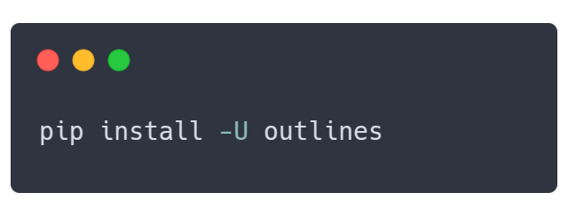
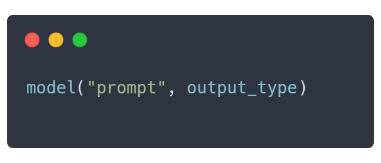

<div align="center" style="margin-bottom: 1em;">

</img>
</img>


 🗒️ *面向大语言模型（LLM）的结构化输出引擎* 🗒️

由 [.txt](https://dottxt.co) 团队倾情❤👷️打造  
<br>深受 NVIDIA、Cohere、HuggingFace、vLLM 等业界顶尖团队的信赖

<p align="center">
  <a href="README.md">English</a> · <b>简体中文</b>
</p>

<!-- Project Badges -->
[![PyPI Version][pypi-version-badge]][pypi]
[![Downloads][downloads-badge]][pypistats]
[![Stars][stars-badge]][stars]

<!-- Community Badges -->
[![Discord][discord-badge]][discord]
[![Blog][dottxt-blog-badge]][dottxt-blog]
[![Twitter][twitter-badge]][twitter]

<br>.txt 官方 API 当前处于早期抢先体验阶段。**[点击此处申请体验 →](https://h1xbpbfsf0w.typeform.com/to/fwQNWmS8?utm_source=github&utm_medium=organic&utm_campaign=outlines)**


</div>

## 🚀 构建结构化生成的未来 (Building the future of structured generation)

我们正与精选合作伙伴紧密协作，共同开发面向结构化生成的新一代交互接口。

无论您需要 XML、FHIR 医疗数据标准、自定义 Schema 模式还是上下文无关文法（Grammar），欢迎随时与我们交流。

模式审查服务：只需分享一份您的 Schema，我们将向您展示在常规生成下可能发生的异常破损点、修复它的约束方案，以及前后的结构合规达标率。欢迎在[此处报名](https://h1xbpbfsf0w.typeform.com/to/rtFUraA2?typeform)。

## 目录 (Table of Contents)

- [为什么选择 Outlines？](#为什么选择-outlines)
- [快速上手](#快速上手)
- [生产级实战案例](#生产级实战案例)
  - [🙋‍♂️ 客户支持工单分流](#-客户支持工单分流)
  - [📦 电商商品分类与属性提取](#-电商商品分类与属性提取)
  - [📊 容忍不完整数据的事件信息解析](#-容忍不完整数据的事件信息解析)
  - [🗂️ 文档预定义类别分类](#️-文档预定义类别分类)
  - [📅 基于函数调用的会议自动预约](#-基于函数调用的会议自动预约)
  - [📝 基于可复用模板动态生成 Prompt](#-基于可复用模板动态生成-prompt)
- [谁在使用 Outlines](#谁在使用-outlines)
- [模型生态集成](#模型生态集成)
- [核心特性](#核心特性)
- [其他实用特性](#其他实用特性)
- [关于 .txt](#关于-txt)
- [社区与交流](#社区与交流)

<div align="center"></img></div>

## 为什么选择 Outlines？

大语言模型（LLM）能力极其强大，但其输出却充满了随机性与不可预测性。业界大多数方案往往试图在生成完成后通过二次解析、复杂的正则表达式或脆弱的字符串后处理代码来补救错误输出。

**Outlines 则从底层直接保证：在生成过程中（Token 采样阶段）100% 输出符合要求的确定性结构化数据。**

- **通用模型适配**：同一套代码可无缝运行于 OpenAI、Ollama、vLLM、Transformers 等主流后端
- **极简集成接口**：仅需传入预期的输出类型即可调用：`model(prompt, output_type)`
- **严格保证结构有效**：彻底告别解析报错或 JSON 格式破损的困扰
- **摆脱供应商绑定**：自由切换底层推理模型而无需重构业务代码


### Outlines 设计哲学

<div align="center"></img></div>

Outlines 遵循与 Python 原生类型系统完全镜像的优雅设计模式。只需声明预期的返回类型，Outlines 即可确保模型生成的数据与该结构毫厘不差地契合：

- 对于 Yes/No 或多选二元分类，直接使用 `Literal["Yes", "No"]`
- 对于数值型输出，直接使用 `int` 或 `float`
- 对于复杂的结构化实体，通过标准的 [Pydantic 模型](https://docs.pydantic.dev/latest/) 进行声明定义

## 快速上手

开启 Outlines 之旅只需简单几步：

### 1. 安装 Outlines

```shell
pip install outlines
```

### 2. 连接到你喜爱的模型

```python
import outlines
from transformers import AutoTokenizer, AutoModelForCausalLM


MODEL_NAME = "microsoft/Phi-3-mini-4k-instruct"
model = outlines.from_transformers(
    AutoModelForCausalLM.from_pretrained(MODEL_NAME, device_map="auto"),
    AutoTokenizer.from_pretrained(MODEL_NAME)
)
```

### 3. 运行基础结构化输出

```python
from typing import Literal
from pydantic import BaseModel


# 基础情感分类
sentiment = model(
    "Analyze: 'This product completely changed my life!'",
    Literal["Positive", "Negative", "Neutral"]
)
print(sentiment)  # "Positive"

# 严格提取特定基础类型
temperature = model("What's the boiling point of water in Celsius?", int)
print(temperature)  # 100
```

### 4. 构建复杂嵌套结构

```python
from pydantic import BaseModel
from enum import Enum

class Rating(Enum):
    poor = 1
    fair = 2
    good = 3
    excellent = 4

class ProductReview(BaseModel):
    rating: Rating
    pros: list[str]
    cons: list[str]
    summary: str

review = model(
    "Review: The XPS 13 has great battery life and a stunning display, but it runs hot and the webcam is poor quality.",
    ProductReview,
    max_new_tokens=200,
)

review = ProductReview.model_validate_json(review)
print(f"Rating: {review.rating.name}")  # "Rating: good"
print(f"Pros: {review.pros}")           # "Pros: ['great battery life', 'stunning display']"
print(f"Summary: {review.summary}")     # "Summary: Good laptop with great display but thermal issues"
```

## 生产级实战案例 (Real-world examples)

以下是展示 Outlines 如何解决实际工程难题的生产就绪级实战代码：

<details id="customer-support-triage"><summary><b>🙋‍♂️ 客户支持工单分流 (Customer Support Triage)</b>
<br>本示例演示如何将自由格式的客户非结构化邮件转化为结构化的服务工单。通过自动解析优先级、分类以及是否需人工介入升级标记，实现支持工单的自动化路由与处理。
</summary>

```python
import outlines
from enum import Enum
from pydantic import BaseModel
from transformers import AutoTokenizer, AutoModelForCausalLM
from typing import List


MODEL_NAME = "microsoft/Phi-3-mini-4k-instruct"
model = outlines.from_transformers(
    AutoModelForCausalLM.from_pretrained(MODEL_NAME, device_map="auto"),
    AutoTokenizer.from_pretrained(MODEL_NAME)
)


def alert_manager(ticket):
    print("Alert!", ticket)


class TicketPriority(str, Enum):
    low = "low"
    medium = "medium"
    high = "high"
    urgent = "urgent"

class ServiceTicket(BaseModel):
    priority: TicketPriority
    category: str
    requires_manager: bool
    summary: str
    action_items: List[str]


customer_email = """
Subject: URGENT - Cannot access my account after payment

I paid for the premium plan 3 hours ago and still can't access any features.
I've tried logging out and back in multiple times. This is unacceptable as I
have a client presentation in an hour and need the analytics dashboard.
Please fix this immediately or refund my payment.
"""

prompt = f"""
<|im_start|>user
Analyze this customer email:

{customer_email}
<|im_end|>
<|im_start|>assistant
"""

ticket = model(
    prompt,
    ServiceTicket,
    max_new_tokens=500
)

# 使用结构化数据自动路由工单
ticket = ServiceTicket.model_validate_json(ticket)
if ticket.priority == "urgent" or ticket.requires_manager:
    alert_manager(ticket)
```
</details>

<details id="e-commerce-product-categorization"><summary><b>📦 电商商品分类与属性提取 (E-commerce product categorization)</b>
<br>此用例展示 Outlines 如何将商品描述自动转化为结构化分类数据（如主品类、子品类与关键属性），大幅优化库存管理效率。每个商品描述均可批量自动处理，显著降低人工标注成本。
</summary>

```python
import outlines
from pydantic import BaseModel
from transformers import AutoTokenizer, AutoModelForCausalLM
from typing import List, Optional


MODEL_NAME = "microsoft/Phi-3-mini-4k-instruct"
model = outlines.from_transformers(
    AutoModelForCausalLM.from_pretrained(MODEL_NAME, device_map="auto"),
    AutoTokenizer.from_pretrained(MODEL_NAME)
)


def update_inventory(product, category, sub_category):
    print(f"Updated {product.split(',')[0]} in category {category}/{sub_category}")


class ProductCategory(BaseModel):
    main_category: str
    sub_category: str
    attributes: List[str]
    brand_match: Optional[str]

# 批量处理商品描述
product_descriptions = [
    "Apple iPhone 15 Pro Max 256GB Titanium, 6.7-inch Super Retina XDR display with ProMotion",
    "Organic Cotton T-Shirt, Men's Medium, Navy Blue, 100% Sustainable Materials",
    "KitchenAid Stand Mixer, 5 Quart, Red, 10-Speed Settings with Dough Hook Attachment"
]

template = outlines.Template.from_string("""
<|im_start|>user
Categorize this product:

{{ description }}
<|im_end|>
<|im_start|>assistant
""")

# 对所有商品获取结构化分类结果
categories = model(
    [template(description=desc) for desc in product_descriptions],
    ProductCategory,
    max_new_tokens=200
)

# 将结构化分类用于库存系统流转
categories = [
    ProductCategory.model_validate_json(category) for category in categories
]
for product, category in zip(product_descriptions, categories):
    update_inventory(product, category.main_category, category.sub_category)
```
</details>

<details id="parse-event-details-with-incomplete-data"><summary><b>📊 容忍不完整数据的事件信息解析 (Parse event details with incomplete data)</b>
<br>本示例使用 Outlines 将活动文本解析为结构化数据（如活动名称、日期、地点、类型与主题），即使在数据残缺时亦能优雅应对。通过联合类型（Union Types），模型可确定性地返回结构化事件或保底返回“I don't know”，确保系统在各类复杂输入下的强鲁棒性。
</summary>

```python
import outlines
from typing import Union, List, Literal
from pydantic import BaseModel
from enum import Enum
from transformers import AutoTokenizer, AutoModelForCausalLM


MODEL_NAME = "microsoft/Phi-3-mini-4k-instruct"
model = outlines.from_transformers(
    AutoModelForCausalLM.from_pretrained(MODEL_NAME, device_map="auto"),
    AutoTokenizer.from_pretrained(MODEL_NAME)
)

class EventType(str, Enum):
    conference = "conference"
    webinar = "webinar"
    workshop = "workshop"
    meetup = "meetup"
    other = "other"


class EventInfo(BaseModel):
    """科技活动的结构化描述"""
    name: str
    date: str
    location: str
    event_type: EventType
    topics: List[str]
    registration_required: bool

# 创建联合类型：可以返回结构化的 EventInfo 或返回字面量 "I don't know"
EventResponse = Union[EventInfo, Literal["I don't know"]]

# 示例活动文本
event_descriptions = [
    # 信息完整的活动
    """
    Join us for DevCon 2023, the premier developer conference happening on November 15-17, 2023
    at the San Francisco Convention Center. Topics include AI/ML, cloud infrastructure, and web3.
    Registration is required.
    """,

    # 信息不足的活动
    """
    Tech event next week. More details coming soon!
    """
]

# 执行事件提取
results = []
for description in event_descriptions:
    prompt = f"""
<|im_start>system
You are a helpful assistant
<|im_end|>
<|im_start>user
Extract structured information about this tech event:

{description}

If there is enough information, return a JSON object with the following fields:

- name: The name of the event
- date: The date where the event is taking place
- location: Where the event is taking place
- event_type: either 'conference', 'webinar', 'workshop', 'meetup' or 'other'
- topics: a list of topics of the conference
- registration_required: a boolean that indicates whether registration is required

If the information available does not allow you to fill this JSON, and only then, answer 'I don't know'.
<|im_end|>
<|im_start|>assistant
"""
    # 联合类型允许模型选择返回有效结构体或明确拒绝回答
    result = model(prompt, EventResponse, max_new_tokens=200)
    results.append(result)

# 展示结果
for i, result in enumerate(results):
    print(f"Event {i+1}:")
    if isinstance(result, str):
        print(f"  {result}")
    else:
        # 解析为 EventInfo 结构化对象
        print(f"  Name: {result.name}")
        print(f"  Type: {result.event_type}")
        print(f"  Date: {result.date}")
        print(f"  Topics: {', '.join(result.topics)}")
    print()

# 将提取到的结构化数据无缝传递至下游系统
structured_count = sum(1 for r in results if isinstance(r, EventInfo))
print(f"Successfully extracted data for {structured_count} of {len(results)} events")
```
</details>

<details id="categorize-documents-into-predefined-types"><summary><b>🗂️ 文档预定义类别分类 (Categorize documents into predefined types)</b>
<br>在此案例中，Outlines 利用 Literal 字面量类型规范将文档严格归类为预设类别（如“财务报告”、“法律合同”）。提取结果既可以转化为表格展示，也可汇总类别分布，生动展示结构化输出对内容治理的赋能。
</summary>

```python
import outlines
from typing import Literal, List
import pandas as pd
from transformers import AutoTokenizer, AutoModelForCausalLM


MODEL_NAME = "microsoft/Phi-3-mini-4k-instruct"
model = outlines.from_transformers(
    AutoModelForCausalLM.from_pretrained(MODEL_NAME, device_map="auto"),
    AutoTokenizer.from_pretrained(MODEL_NAME)
)


# 通过 Literal 约束严格合法的分类标签
DocumentCategory = Literal[
    "Financial Report",
    "Legal Contract",
    "Technical Documentation",
    "Marketing Material",
    "Personal Correspondence"
]

# 待分类的测试文档片段
documents = [
    "Q3 Financial Summary: Revenue increased by 15% year-over-year to $12.4M. EBITDA margin improved to 23% compared to 19% in Q3 last year. Operating expenses...",

    "This agreement is made between Party A and Party B, hereinafter referred to as 'the Parties', on this day of...",

    "The API accepts POST requests with JSON payloads. Required parameters include 'user_id' and 'transaction_type'. The endpoint returns a 200 status code on success."
]

template = outlines.Template.from_string("""
<|im_start|>user
Classify the following document into exactly one category among the following categories:
- Financial Report
- Legal Contract
- Technical Documentation
- Marketing Material
- Personal Correspondence

Document:
{{ document }}
<|im_end|>
<|im_start|>assistant
""")

# 批量执行文档分类
def classify_documents(texts: List[str]) -> List[DocumentCategory]:
    results = []

    for text in texts:
        prompt = template(document=text)
        # 模型被强制约束仅能输出预设类别之一
        category = model(prompt, DocumentCategory, max_new_tokens=200)
        results.append(category)

    return results

# 执行分类
classifications = classify_documents(documents)

# 汇总为 Pandas 结构化表格
results_df = pd.DataFrame({
    "Document": [doc[:50] + "..." for doc in documents],
    "Classification": classifications
})

print(results_df)

# 按类别统计频次分布
category_counts = pd.Series(classifications).value_counts()
print("\nCategory Distribution:")
print(category_counts)
```
</details>

<details>
<summary id="schedule-a-meeting-with-function-calling"><b>📅 基于函数调用的会议自动预约 (Schedule a meeting from requests with Function Calling)</b>
<br>本范例演示 Outlines 如何精准理解自然语言会议诉求，并将其转化为与预定义 Python 函数签名参数完全匹配的结构化实参。成功提取后，即可直接展开调用实现自动预约。
</summary>

```python
import outlines
import json
from typing import List, Optional
from datetime import date
from transformers import AutoTokenizer, AutoModelForCausalLM


MODEL_NAME = "microsoft/phi-4"
model = outlines.from_transformers(
    AutoModelForCausalLM.from_pretrained(MODEL_NAME, device_map="auto"),
    AutoTokenizer.from_pretrained(MODEL_NAME)
)


# 定义具有严格类型注记的函数签名
def schedule_meeting(
    title: str,
    date: date,
    duration_minutes: int,
    attendees: List[str],
    location: Optional[str] = None,
    agenda_items: Optional[List[str]] = None
):
    """使用指定详情预约会议"""
    meeting = {
        "title": title,
        "date": date,
        "duration_minutes": duration_minutes,
        "attendees": attendees,
        "location": location,
        "agenda_items": agenda_items
    }
    return f"Meeting '{title}' scheduled for {date} with {len(attendees)} attendees"

# 自然语言原始需求
user_request = """
I need to set up a product roadmap review with the engineering team for next
Tuesday at 2pm. It should last 90 minutes. Please invite john@example.com,
sarah@example.com, and the product team at product@example.com.
"""

# Outlines 会自动从目标函数的签名中反向推导所需的生成结构
prompt = f"""
<|im_start|>user
Extract the meeting details from this request:

{user_request}
<|im_end|>
<|im_start|>assistant
"""
meeting_params = model(prompt, schedule_meeting, max_new_tokens=200)

# 返回结果为符合函数入参要求的结构化数据
meeting_params = json.loads(meeting_params)
print(meeting_params)

# 直接以解包字典形式调用目标业务函数
result = schedule_meeting(**meeting_params)
print(result)
# "Meeting 'Product Roadmap Review' scheduled for 2023-10-17 with 3 attendees"
```
</details>

<details>
<summary id="dynamically-generate-prompts-with-re-usable-templates"><b>📝 基于可复用模板动态生成 Prompt (Dynamically generate prompts with re-usable templates)</b>
<br>借助基于 Jinja 的模板引擎，本例展示了如何为情感分析等任务动态生成提示词。它演示了如何便捷地跨不同内容类型定制、重用提示词逻辑（包含 Few-shot 少样本提示），同时全程确保模型输出保持结构化。
</summary>

```python
import outlines
from typing import List, Literal
from transformers import AutoTokenizer, AutoModelForCausalLM


MODEL_NAME = "microsoft/phi-4"
model = outlines.from_transformers(
    AutoModelForCausalLM.from_pretrained(MODEL_NAME, device_map="auto"),
    AutoTokenizer.from_pretrained(MODEL_NAME)
)


# 1. 使用 Jinja 语法构建可复用模板
sentiment_template = outlines.Template.from_string("""
<|im_start>user
Analyze the sentiment of the following {{ content_type }}:

{{ text }}

Provide your analysis as either "Positive", "Negative", or "Neutral".
<|im_end>
<|im_start>assistant
""")

# 2. 传入动态参数渲染 Prompt
review = "This restaurant exceeded all my expectations. Fantastic service!"
prompt = sentiment_template(content_type="review", text=review)

# 3. 结合模板渲染结果进行结构化生成
result = model(prompt, Literal["Positive", "Negative", "Neutral"])
print(result)  # "Positive"

# 模板同样支持从独立外部文件加载
example_template = outlines.Template.from_file("templates/few_shot.txt")

# 结合少样本示例实现 Few-shot 推理
examples = [
    ("The food was cold", "Negative"),
    ("The staff was friendly", "Positive")
]
few_shot_prompt = example_template(examples=examples, query="Service was slow")
print(few_shot_prompt)
```
</details>

## 谁在使用 Outlines (They use outlines)

<div align="center">
</img>
</img>
</div>

## 模型生态集成 (Model Integrations)

| 模型类别 | 说明 | 官方文档 |
|---------|-------------|:-------------:|
| **服务端推理后端** | vLLM 与 Ollama | [服务端集成指南 →](https://dottxt-ai.github.io/outlines/latest/features/models/) |
| **本地模型后端** | transformers 与 llama.cpp | [本地模型集成指南 →](https://dottxt-ai.github.io/outlines/latest/features/models/) |
| **云端 API 支持** | OpenAI、Gemini 以及 [Dottxt](https://h1xbpbfsf0w.typeform.com/to/fwQNWmS8?utm_source=github&utm_medium=organic&utm_campaign=outlines) | [API 服务集成指南 →](https://dottxt-ai.github.io/outlines/latest/features/models/) |

## 核心特性 (Core Features)

| 核心特性 | 功能描述 | 官方文档 |
|---------|-------------|:-------------:|
| **多选项枚举限制 (Multiple Choices)** | 强制将模型输出约束至预定义的选项列表中 | [多选项使用指南 →](https://dottxt-ai.github.io/outlines/latest/features/core/output_types/#multiple-choices) |
| **函数调用入参生成 (Function Calls)** | 自动根据 Python 函数入参签名反向推导所需输出结构 | [函数调用指南 →](https://dottxt-ai.github.io/outlines/latest/features/core/output_types/#json-schemas) |
| **JSON / Pydantic 约束** | 保证生成完全符合 JSON Schema 与 Pydantic 数据规范的文本 | [JSON 生成指南 →](https://dottxt-ai.github.io/outlines/latest/features/core/output_types/#json-schemas) |
| **正则表达式约束 (Regular Expressions)** | 严格按照正则表达式模式匹配引导生成文本 | [正则约束指南 →](https://dottxt-ai.github.io/outlines/latest/features/core/output_types/#regex-patterns) |
| **文法约束生成 (Grammars)** | 强制执行复杂的上下文无关文法（CFG）生成语法解析树 | [文法约束指南 →](https://dottxt-ai.github.io/outlines/latest/features/core/output_types/#context-free-grammars) |

## 其他实用特性 (Other Features)

| 实用特性 | 功能描述 | 官方文档 |
|---------|-------------|:-------------:|
| **Prompt 模板引擎** | 将复杂的提示词渲染逻辑与业务核心代码解耦 | [模板引擎指南 →](https://dottxt-ai.github.io/outlines/latest/features/utility/template/) |
| **自定义类型扩展** | 提供直观的接口构建高级自定义类型系统 | [Python 类型指南 →](https://dottxt-ai.github.io/outlines/latest/features/core/output_types/#basic-python-types) |
| **应用封装 (Applications)** | 将渲染模板与结构约束一并封装为高阶函数 | [应用封装指南 →](https://dottxt-ai.github.io/outlines/latest/features/utility/application/) |

## 关于 .txt (About .txt)

<div align="center">
</img>
</img>
</div>

Outlines 由 [.txt](https://dottxt.co) 公司全力开发并持续维护，我们致力于让 LLM 在生产级关键应用场景中更加稳健可靠。

我们的核心方向聚焦于推动结构化生成技术的突破与落地：

- 🧪 **前沿学术研究**：我们持续公开发布关于[结构化生成技术与性能](http://blog.dottxt.co/performance-gsm8k.html)的最新科研成果
- 🚀 **企业级解决方案**：提供高吞吐、生产级的[企业商用函数库授权](https://docs.dottxt.co)
- 🧩 **开源协同生态**：我们坚信公开构建（Build in Public）并积极反哺开源社区

欢迎在 [Twitter (X)](https://twitter.com/dottxtai) 上关注我们，或查阅我们的[技术博客](https://blog.dottxt.co/)，获取关于构建高可靠 LLM 应用的最新动态。

## 社区与交流 (Community)

<div align="center" style="margin-bottom: 1em;">

[![Contributors][contributors-badge]][contributors]
[![Stars][stars-badge]][stars]
[![Downloads][downloads-badge]][pypistats]
[![Discord badge][discord-badge]][discord]

</div>

- 💡 **有新想法？** 欢迎加入 [Discord][discord] 官方频道与我们交流探讨
- 🐞 **发现了 Bug？** 欢迎随时提交 GitHub [Issue](https://github.com/dottxt-ai/outlines/issues)
- 🧩 **想参与贡献？** 请参考官方[贡献指南](https://dottxt-ai.github.io/outlines/latest/community/contribute/)

## 引用 Outlines (Cite Outlines)

如果您在学术科研或工程应用中受益于 Outlines，请按照如下格式引用我们的学术论文：

```bibtex
@article{willard2023efficient,
  title={Efficient Guided Generation for Large Language Models},
  author={Willard, Brandon T and Louf, R{\'e}mi},
  journal={arXiv preprint arXiv:2307.09702},
  year={2023}
}
```

[contributors]: https://github.com/dottxt-ai/outlines/graphs/contributors
[contributors-badge]: https://img.shields.io/github/contributors/dottxt-ai/outlines?style=flat-square&logo=github&logoColor=white&color=ECEFF4
[dottxt-blog]: https://blog.dottxt.co/
[dottxt-blog-badge]: https://img.shields.io/badge/dottxt%20blog-a6b4a3
[dottxt-twitter]: https://twitter.com/dottxtai
[dottxt-twitter-badge]: https://img.shields.io/twitter/follow/dottxtai?style=social
[discord]: https://discord.gg/R9DSu34mGd
[discord-badge]: https://img.shields.io/discord/1182316225284554793?color=ddb8ca&logo=discord&logoColor=white&style=flat-square
[downloads-badge]: https://img.shields.io/pypi/dm/outlines?color=A6B4A3&logo=python&logoColor=white&style=flat-square
[pypistats]: https://pypistats.org/packages/outlines
[pypi-version-badge]: https://img.shields.io/pypi/v/outlines?style=flat-square&logoColor=white&color=ddb8ca
[pypi]: https://pypi.org/project/outlines/
[stars]: https://github.com/dottxt-ai/outlines/stargazers
[stars-badge]: https://img.shields.io/github/stars/dottxt-ai/outlines?style=flat-square&logo=github&color=BD932F&logoColor=white
[twitter-badge]: https://img.shields.io/twitter/follow/dottxtai?style=flat-square&logo=x&logoColor=white&color=bd932f
[twitter]: https://x.com/dottxtai

---

> 💡 **文档维护说明**：本中文文档由社区志愿者（@JasonYeYuhe）翻译维护，最后同步更新于 2026年09月13日。如发现内容与官方英文原版存在差异或新特性滞后，欢迎提交 PR 共同完善！
