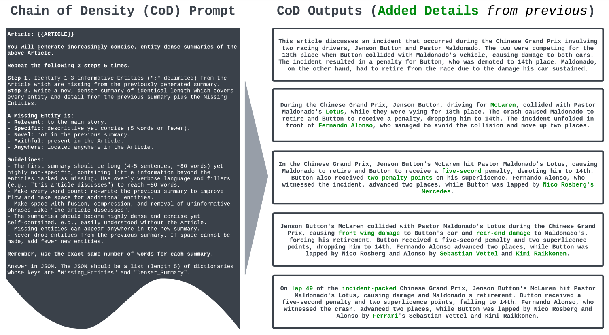

# Summarize documents using Chain of Density prompting

A good summary should be informative, concise and clear. While large language models are generally good at summarizing documents, their summaries tend to be long and contain redundant information; their information density tends to be on the lower end. This is where [chain of Density](https://arxiv.org/abs/2309.04269), a new prompting technique, comes in. In this example we will show how one can implement chain of density with a few lines of code using Outlines, leveraging both Outline's prompt templating and its structured generation capabilities.

The article we will try to summarize is the first three paragraphs of the [Alan Turing page on Wikipedia](https://en.wikipedia.org/wiki/Alan_Turing):

```python
article = """
Alan Mathison Turing OBE FRS (/ˈtjʊərɪŋ/; 23 June 1912 – 7 June 1954) was an English mathematician, computer scientist, logician, cryptanalyst, philosopher and theoretical biologist.[5] Turing was highly influential in the development of theoretical computer science, providing a formalisation of the concepts of algorithm and computation with the Turing machine, which can be considered a model of a general-purpose computer.[6][7][8] He is widely considered to be the father of theoretical computer science and artificial intelligence.[9]

Born in Maida Vale, London, Turing was raised in southern England. He graduated at King's College, Cambridge, with a degree in mathematics. Whilst he was a fellow at Cambridge, he published a proof demonstrating that some purely mathematical yes–no questions can never be answered by computation. He defined a Turing machine and proved that the halting problem for Turing machines is undecidable. In 1938, he obtained his PhD from the Department of Mathematics at Princeton University. During the Second World War, Turing worked for the Government Code and Cypher School at Bletchley Park, Britain's codebreaking centre that produced Ultra intelligence. For a time he led Hut 8, the section that was responsible for German naval cryptanalysis. Here, he devised a number of techniques for speeding the breaking of German ciphers, including improvements to the pre-war Polish bomba method, an electromechanical machine that could find settings for the Enigma machine. Turing played a crucial role in cracking intercepted coded messages that enabled the Allies to defeat the Axis powers in many crucial engagements, including the Battle of the Atlantic.[10][11]

After the war, Turing worked at the National Physical Laboratory, where he designed the Automatic Computing Engine, one of the first designs for a stored-program computer. In 1948, Turing joined Max Newman's Computing Machine Laboratory at the Victoria University of Manchester, where he helped develop the Manchester computers[12] and became interested in mathematical biology. He wrote a paper on the chemical basis of morphogenesis[1] and predicted oscillating chemical reactions such as the Belousov–Zhabotinsky reaction, first observed in the 1960s. Despite these accomplishments, Turing was never fully recognised in Britain during his lifetime because much of his work was covered by the Official Secrets Act.[13]
"""
```

## How Chain Of Density works

Chain Of Density starts with asking the model to generate a first long and non-specific summary. Then it asks the model to generate 4 extra summaries by proceeding in the following way:

1. Identify 1-3 entities missing in the previous summary;
2. Add all entities marked as missing in the previous step, while not dropping entities;
3. Make the summary more concise;

The prompt also asks the model to return a list of JSON objects that contain the missing entities and the new summary. This is where structured generation will come in handy :) The paper provides the prompt and an example:



We can now implement the prompt provided in the paper:

```python
import outlines

@outlines.prompt
def chain_of_density(article):
    """Article: {{ article }}

    You will generate increasingly concise, entity-dense summaries of the above Article.

    Repeat the following 2 steps 5 times.

    Step 1. Identify 1-3 informative Entities ("; " delimited) from the Article which are missing from the previously generated summary.
    Step 2. Write a new, denser summary of identical length which covers every entity and detail from the previous summary plus the Missing Entities.

    A Missing Entity is:
    - Relevant: to the main story.
    - Specific: descriptive yet concise (5 words or fewer).
    - Novel: not in the previous summary.
    - Faithful: present in the Article.
    - Anywhere: located anywhere in the Article.

    Guidelines:
    - The first summary should be long (4-5 sentences, ~80 words) yet highly non-specific, containing little information beyond the entities marked as missing. Use overly verbose language and fillers (e.g., "this article discusses") to reach ~80 words.
    - Make every word count: rewrite the previous summary to improve flow and make space for additional entities.
    - Make space with fusion, compression, and removal of uninformative phrases like "the article discusses".
    - The summaries should become highly dense and concise yet self-contained, e.g., easily understood without the Article.
    - Missing entities can appear anywhere in the new summary.
    - Never drop entities from the previous summary. If space cannot be made, add fewer new entities.

    Remember, use the exact same number of words for each summary.

    Answer in JSON. The JSON should be a a dictionary with key "summaries" that contains a list (length 5) of dictionaries whose keys are "Missing_Entities" and "Denser_Summary".
    """
```

??? Note

    Note that we modified the prompt slightly so it returns a JSON object that contains the summaries, instead of a list of summaries.


## Outlines implementation

We will use Outline's JSON-structured generation to ensure that the model's output is consistent with the format specified in the prompt. We start with defining the JSON objects that the model is asked to return using Pydantic. One JSON object that contains a list of `Summary` objects that contain the missing entities and new summary:

```python
from pydantic import BaseModel, conlist

class Summary(BaseModel):
    missing_entities: str
    denser_summary: str

class Summaries(BaseModel):
    summaries: conlist(Summary, max_length=5, min_length=5)
```

We now generate the prompt by passing the article we want to summarize to the template. We load a quantized version of Mistral-7B using the AutoAWQ library, and then use JSON-structured generation to generate the summaries:

```python
model = outlines.models.transformers("TheBloke/Mistral-7B-OpenOrca-AWQ")

prompt = chain_of_density(article)
result = outlines.generate.json(model, Summaries)(prompt)
```

We can now check the results:

```python
print(result.model_dump())
# {'summaries': [
#     {
#       'missing_entities': 'English mathematician, cryptanalyst, philosopher',
#       'denser_summary': 'Alan Mathison Turing was an English mathematician, cryptanalyst, philosopher.'
#     },
#     {
#       'missing_entities': '',
#       'denser_summary': "Alan Mathison Turing was an English mathematician who was a crucial figure in WW2's Bletchley Park codebreaking centre and designed one of the first computers."
#     },
#     {
#       'missing_entities': 'cryptanalyst, studied, biology, father',
#       'denser_summary': 'Alan Mathison Turing was an English cryptanalyst, studied theoretical computer science, and contributed to mathematical biology.'
#     },
#     {
#       'missing_entities': 'biology, morphogenesis, chemical',
#       'denser_summary': 'Alan Mathison Turing was an English cryptanalyst, studied theoretical computer science, and predicted chemical reactions in morphogenesis.
#     '},
#     {
#       'missing_entities': '',
#       'denser_summary': 'Alan Mathison Turing was an English cryptanalyst, developed computer science, and made strides in mathematical biology research.'
#       }
# ]}
```

Not bad, considering we used a smallish model to generate the summary! Chain of Density seems to be a very effective prompting technique to generate dense summaries, even with small quantized models. Its implementation in Outlines is also very short.

Note that this is the first article I tried and it worked out of the box. Try it out on other articles, and please share the results on Twitter, or by opening [a new discussion](https://github.com/outlines-dev/outlines/discussions/categories/show-and-tell) on the Outlines repository!
