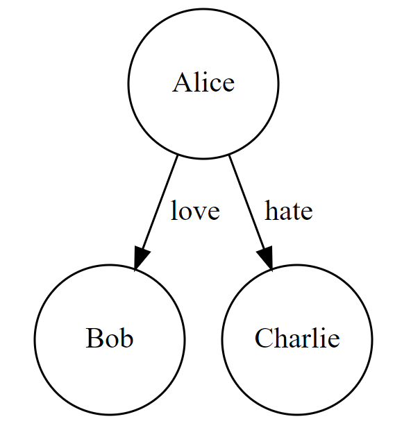

# Knowledge Graph Extraction

In this guide, we use [outlines](https://dottxt-ai.github.io/outlines/) to extract a knowledge graph from unstructured text.

We will use [llama.cpp](https://github.com/ggerganov/llama.cpp) using the [llama-cpp-python](https://github.com/abetlen/llama-cpp-python) library. Outlines supports llama-cpp-python, but we need to install it ourselves:

```bash
pip install llama-cpp-python
```

We download the model weights by passing the name of the repository on the HuggingFace Hub, and the filenames (or glob pattern):
```python
import llama_cpp
from outlines import generate, models

model = models.llamacpp("NousResearch/Hermes-2-Pro-Llama-3-8B-GGUF",
            "Hermes-2-Pro-Llama-3-8B-Q4_K_M.gguf",
            tokenizer=llama_cpp.llama_tokenizer.LlamaHFTokenizer.from_pretrained(
            "NousResearch/Hermes-2-Pro-Llama-3-8B"
            ),
            n_gpu_layers=-1,
            flash_attn=True,
            n_ctx=8192,
            verbose=False)
```

??? note "(Optional) Store the model weights in a custom folder"

    By default the model weights are downloaded to the hub cache but if we want so store the weights in a custom folder, we pull a quantized GGUF model [Hermes-2-Pro-Llama-3-8B](https://huggingface.co/NousResearch/Hermes-2-Theta-Llama-3-8B-GGUF) by [NousResearch](https://nousresearch.com/) from [HuggingFace](https://huggingface.co/):

    ```bash
    wget https://hf.co/NousResearch/Hermes-2-Pro-Llama-3-8B-GGUF/resolve/main/Hermes-2-Pro-Llama-3-8B-Q4_K_M.gguf
    ```

    We initialize the model:

    ```python
    import llama_cpp
    from llama_cpp import Llama
    from outlines import generate, models

    llm = Llama(
        "/path/to/model/Hermes-2-Pro-Llama-3-8B-Q4_K_M.gguf",
        tokenizer=llama_cpp.llama_tokenizer.LlamaHFTokenizer.from_pretrained(
            "NousResearch/Hermes-2-Pro-Llama-3-8B"
        ),
        n_gpu_layers=-1,
        flash_attn=True,
        n_ctx=8192,
        verbose=False
    )
    ```

## Knowledge Graph Extraction

We first need to define our Pydantic class for each node and each edge of the knowledge graph:

```python
from pydantic import BaseModel, Field

class Node(BaseModel):
    """Node of the Knowledge Graph"""

    id: int = Field(..., description="Unique identifier of the node")
    label: str = Field(..., description="Label of the node")
    property: str = Field(..., description="Property of the node")


class Edge(BaseModel):
    """Edge of the Knowledge Graph"""

    source: int = Field(..., description="Unique source of the edge")
    target: int = Field(..., description="Unique target of the edge")
    label: str = Field(..., description="Label of the edge")
    property: str = Field(..., description="Property of the edge")
```

We then define the Pydantic class for the knowledge graph and get its JSON schema:

```python
from typing import List

class KnowledgeGraph(BaseModel):
    """Generated Knowledge Graph"""

    nodes: List[Node] = Field(..., description="List of nodes of the knowledge graph")
    edges: List[Edge] = Field(..., description="List of edges of the knowledge graph")

schema = KnowledgeGraph.model_json_schema()
```

We then need to adapt our prompt to the [Hermes prompt format for JSON schema](https://github.com/NousResearch/Hermes-Function-Calling?tab=readme-ov-file#prompt-format-for-json-mode--structured-outputs):

```python
def generate_hermes_prompt(user_prompt):
    return (
        "<|im_start|>system\n"
        "You are a world class AI model who answers questions in JSON "
        f"Here's the json schema you must adhere to:\n<schema>\n{schema}\n</schema><|im_end|>\n"
        "<|im_start|>user\n"
        + user_prompt
        + "<|im_end|>"
        + "\n<|im_start|>assistant\n"
        "<schema>"
    )
```

For a given user prompt, for example:

```python
user_prompt = "Alice loves Bob and she hates Charlie."
```

We can use `generate.json` by passing the Pydantic class we previously defined, and call the generator with the Hermes prompt:

```python
from outlines import generate, models

model = models.LlamaCpp(llm)
generator = generate.json(model, KnowledgeGraph)
prompt = generate_hermes_prompt(user_prompt)
response = generator(prompt, max_tokens=1024, temperature=0, seed=42)
```

We obtain the nodes and edges of the knowledge graph:

```python
print(response.nodes)
print(response.edges)
# [Node(id=1, label='Alice', property='Person'),
# Node(id=2, label='Bob', property='Person'),
# Node(id=3, label='Charlie', property='Person')]
# [Edge(source=1, target=2, label='love', property='Relationship'),
# Edge(source=1, target=3, label='hate', property='Relationship')]
```

## (Optional) Visualizing the Knowledge Graph

We can use the [Graphviz library](https://graphviz.readthedocs.io/en/stable/) to visualize the generated knowledge graph. For detailed installation instructions, see [here](https://graphviz.readthedocs.io/en/stable/#installation).

```python
from graphviz import Digraph

dot = Digraph()
for node in response.nodes:
    dot.node(str(node.id), node.label, shape='circle', width='1', height='1')
for edge in response.edges:
    dot.edge(str(edge.source), str(edge.target), label=edge.label)

dot.render('knowledge-graph.gv', view=True)
```



This example was originally contributed by [Alonso Silva](https://github.com/alonsosilvaallende).
