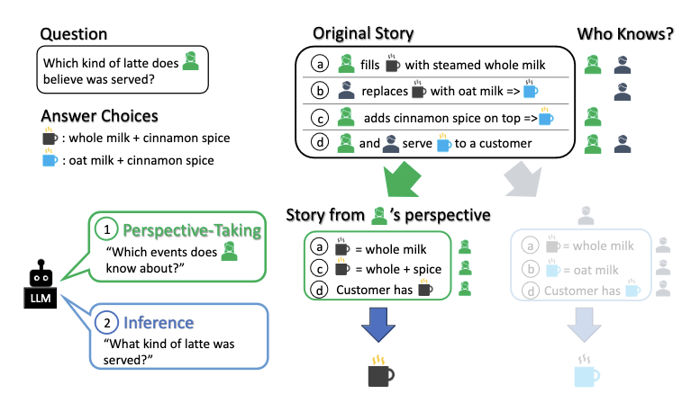

# Build perspective-taking agents with SimToM

Prompting strategies like Chain-of-Thought (CoT) can improve LLMs' reasoning capabilities. However, they underwhelm in tasks that require keeping track of inconsistent world states. [SimToM](https://arxiv.org/abs/2311.10227) proposes a simple, two-stage prompting framework for LLMs inspired by Simulation Theory. The authors showed that this approach outperforms zero-shot prompting and CoT on ToMI and BigToM, two benchmarks with Theory of Mind questions.

In this example, we will implement SimToM with a few lines of code using Outlines' prompt templating and structured generation capabilities.

## How SimToM works

SimToM calls an LLM with two consecutive prompts:

1. **Perspective-taking**: The first prompt receives a `story` and a `character`. The goal is to understand the situation based on the character's point of view and filter out the rest of the story.
2. **Question-Answering**: The second prompt receives the character's point of view from the previous step and tasks the LLM to answer a question using that context.



## Outlines implementation

To implement SimToM with Outlines, we will need to:

1. Write the prompts with [prompt functions](https://dottxt-ai.github.io/outlines/latest/reference/prompting/).
2. Define the JSON object each prompt will return using Pydantic.
3. Generate responses with a Mistral model using the [transformers integration](https://dottxt-ai.github.io/outlines/latest/reference/models/transformers/).

Let's dive into it!

### Using Prompt Functions

With Outlines, you can write your prompts as Python functions by adding the `@outlines.prompt` decorator. The prompt template is contained in their docstring, and their arguments correspond to variables used in the prompt.

The authors have shared their code, prompts and data in [this GitHub repository](https://github.com/shawnsihyunlee/simulatedtom). Below, we define in Outlines the prompts they used for the ToMI dataset:

```python
import outlines


@outlines.prompt
def perspective_taking(story: str, character: str) -> None:
    """<s>[INST] The following is a sequence of events about some characters, that takes place in multiple locations.
    Your job is to output only the events that the specified character, {{character}}, knows about.

    Here are a few rules:
    1. A character knows about all events that they do.
    2. If a character is in a certain room/location, that character knows about all other events that happens in the room. This includes other characters leaving or exiting the location, the locations of objects in that location, and whether somebody moves an object to another place.
    3. If a character leaves a location, and is NOT in that location, they no longer know about any events that happen within that location. However, they can re-enter the location.

    Story: {{story}}
    What events does {{character}} know about? Only output the events according to the above rules, do not provide an explanation. [/INST]""" # noqa

@outlines.prompt
def simulation(events: list, name: str, question: str) -> None:
    """<s>[INST] 
    {{event}}
    
    You are {{name}}.
    Based on the above information, answer the following question:
    {{question}}
    You must choose one of the above choices, do not say there is not enough information. Answer with a single word, do not output anything else. [/INST]""" # noqa
```

### JSON Structured Generation

Outlines guarantees that the LLM will return a valid JSON object, which we can specify as a Pydantic model.

We will need two Pydantic models for SimToM, one for each prompt:

```python
from pydantic import BaseModel, Field
from typing import List


class PerspectiveTaking(BaseModel):
    """This is for the first prompt."""
    character: str = Field(description="The character we extract the events for.")
    events: List[str] = Field(description="All events that the character knows about.")


class Simulation(BaseModel):
    """This is for the second prompt."""
    answer: str
```

### Calling an LLM

Let's try SimToM with an example from the ToMI dataset:

```python
story = """
1 Aria entered the front_yard.
2 Aiden entered the front_yard.
3 The grapefruit is in the green_bucket.
4 Aria moved the grapefruit to the blue_container.
5 Aiden exited the front_yard.
6 Noah entered the playroom.
"""
question = "7 Where was the grapefruit at the beginning?"
character = "Aria"
```

We load `Mistral-7B-Instruct-v0.3`, create the prompt using the template we defined earlier, and generate a structured response. As a reminder, the goal of the first call is to get all the events a character, `Aria`, knows about.

```python
# Load an LLM from Hugging Face
MODEL_NAME = "mistral-community/Mistral-7B-Instruct-v0.3"
model = outlines.models.transformers(MODEL_NAME, device="cuda")

perspective_prompt = perspective_taking(story=story, character=character)

# Call Mistral 7B with the first prompt
generator = outlines.generate.json(model, PerspectiveTaking)
perspective = generator(perspective_prompt)

print(perspective.model_dump())
# {'character': 'Aria', 'events': ['1 Aria entered the front_yard.', '3 The grapefruit is in the green_bucket.', '4 Aria moved the grapefruit to the blue_container.']}
```

Not bad! We will now generate the second prompt with those events.

```python
sim_prompt = simulation(events=perspective.events, name=character, question=question)

# Call Mistral 7B with the second prompt
generator = outlines.generate.json(model, Simulation)
result = generator(sim_prompt)

print(result.model_dump())
# {'answer': 'green_bucket'}
```

And this is it! SimToM could be useful in agentic workflows, where agents must act based on what they know, not all available information. One caveat of SimToM is that the perspective-taking step may remove important information, leading to wrong results. As the authors note in their paper, it can feature as a simple and effective baseline for evaluating LLMs on Theory of Mind reasoning tasks.
