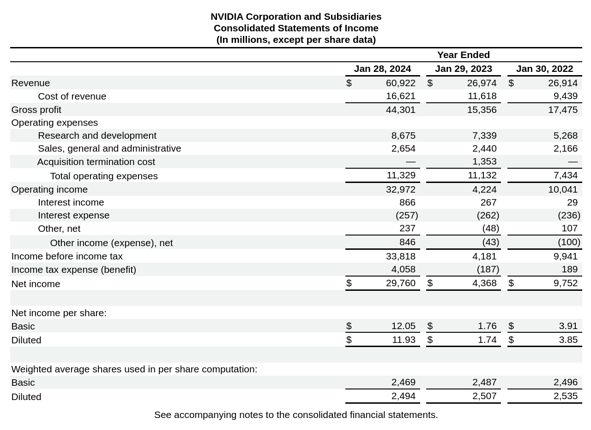

# Extracting financial data from earnings reports

A common task in finance is to extract financial data from earnings reports. Earnings reports are infamously poorly formatted, as the SEC does not have requirements for producing machine-readable documents.

Earnings reports are often provided as HTML documents, which can be difficult to parse. Investors often use complicated parsing systems or manual review to extract data. Entire companies are built around automating this task.

This cookbook is a proof of concept about how we can use LLMs to extract financial data directly into CSV. Comma-separated values are well-structured and can be defined by a regular expression, which Outlines can use to guide the LLM's output.

The example is a smaller subset of a full demo found [here](https://github.com/dottxt-ai/demos/tree/main/earnings-reports). The demo contains the full set of pre-processing steps needed to convert raw HTML into a structured CSV file, and tests the results across three company's 10k reports.

## Setup

Install outlines and required dependencies:

```shell
# Later versions of torch can have difficulty with certain CUDA drivers.
# We recommend using 2.4.0 for now, but you may wish to experiment with
# other versions.
pip install outlines pandas transformers torch==2.4.0 accelerate
```

## Load the model

Choose your language model. We'll use Phi-3 mini, which is small enough to run on reasonably small machines.

```python
import outlines
import torch
import transformers

model_name = 'microsoft/Phi-3-mini-4k-instruct'
tf_model = transformers.AutoModelForCausalLM.from_pretrained(
    model_name, device_map="cuda", torch_dtype=torch.bfloat16
)
tf_tokenizer = transformers.AutoTokenizer.from_pretrained(model_name)
model = outlines.from_transformers(tf_model, tf_tokenizer)
```

## Set up the data

For brevity, we've attached the markdown version of Nvidia's 10k report. The [full demonstration](https://github.com/dottxt-ai/demos/tree/main/earnings-reports) processes the raw HTML version of the report to these markdown tables. Pages are filtered by whether they seem to contain income statements, and then compacted into the string you see below.

```python
income_statement = """
Table of ContentsNVIDIA Corporation and SubsidiariesConsolidated Statements of Income(In millions, except per share data)

|  |  |  |  |  |  |  |  |  |  |  |  |  |  |  |  |  |  |
| --- | --- | --- | --- | --- | --- | --- | --- | --- | --- | --- | --- | --- | --- | --- | --- | --- | --- |
|  | | | Year Ended | | | | | | | | | | | | | | |
|  | | | Jan 28, 2024 | | |  | | | Jan 29, 2023 | | |  | | | Jan 30, 2022 | | |
| Revenue | | | $ | 60,922 |  |  | | | $ | 26,974 |  |  | | | $ | 26,914 |  |
| Cost of revenue | | | 16,621 | |  |  | | | 11,618 | |  |  | | | 9,439 | |  |
| Gross profit | | | 44,301 | |  |  | | | 15,356 | |  |  | | | 17,475 | |  |
| Operating expenses | | |  | | |  | | |  | | |  | | |  | | |
| Research and development | | | 8,675 | |  |  | | | 7,339 | |  |  | | | 5,268 | |  |
| Sales, general and administrative | | | 2,654 | |  |  | | | 2,440 | |  |  | | | 2,166 | |  |
| Acquisition termination cost | | | — | |  |  | | | 1,353 | |  |  | | | — | |  |
| Total operating expenses | | | 11,329 | |  |  | | | 11,132 | |  |  | | | 7,434 | |  |
| Operating income | | | 32,972 | |  |  | | | 4,224 | |  |  | | | 10,041 | |  |
| Interest income | | | 866 | |  |  | | | 267 | |  |  | | | 29 | |  |
| Interest expense | | | (257) | |  |  | | | (262) | |  |  | | | (236) | |  |
| Other, net | | | 237 | |  |  | | | (48) | |  |  | | | 107 | |  |
| Other income (expense), net | | | 846 | |  |  | | | (43) | |  |  | | | (100) | |  |
| Income before income tax | | | 33,818 | |  |  | | | 4,181 | |  |  | | | 9,941 | |  |
| Income tax expense (benefit) | | | 4,058 | |  |  | | | (187) | |  |  | | | 189 | |  |
| Net income | | | $ | 29,760 |  |  | | | $ | 4,368 |  |  | | | $ | 9,752 |  |
|  | | |  | | |  | | |  | | |  | | |  | | |
| Net income per share: | | |  | | |  | | |  | | |  | | |  | | |
| Basic | | | $ | 12\.05 |  |  | | | $ | 1\.76 |  |  | | | $ | 3\.91 |  |
| Diluted | | | $ | 11\.93 |  |  | | | $ | 1\.74 |  |  | | | $ | 3\.85 |  |
|  | | |  | | |  | | |  | | |  | | |  | | |
| Weighted average shares used in per share computation: | | |  | | |  | | |  | | |  | | |  | | |
| Basic | | | 2,469 | |  |  | | | 2,487 | |  |  | | | 2,496 | |  |
| Diluted | | | 2,494 | |  |  | | | 2,507 | |  |  | | | 2,535 | |  |
"""
```

The markdown tables extracted from the earnings reports can vary widely in row names, column counts, data types, etc. The advantage of LLMs here is that we can define the data we want in terms of the data types, and the LLM will output the data in the desired format.

For comparison, here is how the income statement looks in the original HTML:



## Define the data we want

Outlines is often used for JSON output, but it can also be used for CSV. We know the columns we want to extract, and we know the data types of the columns. Year for example is always a four-digit number, revenue is a number with commas, and so on.

We can define a regex pattern for each column type:

```python
# Define the column type regex patterns
column_types = {
    # Year is always a four-digit number
    "year": r"\d{4}",

    # Revenue, operating income, and net income are always numbers with commas.
    # This regex permits integers that may begin with a minus sign, and may have
    # commas separating the thousands, millions, etc.
    "integer_comma": r"((-?\d+),?\d+|(-?\d+))",
    # Number is currently not used, but it represents a number with up to two decimal places.
    "number": r"(-?\d+(?:\.\d{1,2})?)",
}
```

Next, let's choose the columns we want to extract. We want

- Year, always a four-digit number
- Revenue, a number with commas
- Operating income, a number with commas
- Net income, a number with commas

```python
# Define the columns to extract, and their data types.
columns_to_extract = {
    "year": "year",
    "revenue": "integer_comma",
    "operating_income": "integer_comma",
    "net_income": "integer_comma",
}
```

You can modify `column_type_regex` to match the data types of the columns you want to extract.  Adding a new financial metric to extract is as simple as adding a new key/value pair to `columns_to_extract`:

```python
columns_to_extract["diluted_earnings_per_share"] = "number"
```

Additional columns are not well tested for accuracy, so use with caution.

## Create the regex describing the data we want


```python
# Create the header line. This is the requested column names
# separated by commas, i.e. "year,revenue,..."
header = ",".join(columns_to_extract.keys())

# Create the data capture patterns. These are the regex patterns
# that will be used to capture the data in each column
data_patterns = [column_types[dtype] for dtype in columns_to_extract.values()]
data_line = ",".join(data_patterns)

# Our final regex pattern.
max_rows = 3 # We expect 3 rows of data, firms usually report 3 years of income statements
csv_regex = f"{header}(\n{data_line}){{,{max_rows}}}\n\n"

print(csv_regex)
```

which gives us

```
year,revenue,operating_income,net_income,basic_earnings_per_share(
\d{4},((-?\d+),?\d+|(-?\d+)),((-?\d+),?\d+|(-?\d+)),((-?\d+),?\d+|(-?\d+)),(-?\d+(?:\.\d{1,2})?)){,3}
```

Pretty hairy, right? Thankfully, we have a simple function to construct this regex for you. The regex defines a header line, followed by a data line that repeats for each row of data we want to extract. Passing the regex to `outlines.Generator` will produce a function that will __always__ produce a CSV string that is consistent with the regex.

## Prompting the model

Outlines does not add system or instruction tokens by default, so we need to use `transformers.AutoTokenizer` to add them for whatever model we're using.

```python
from transformers import AutoTokenizer

tokenizer = AutoTokenizer.from_pretrained(model_name)

def add_instruction(prompt):
    return tokenizer.apply_chat_template([{"role": "user", "content": prompt}], tokenize=False, add_generation_prompt=True)

print(add_instruction("Howdy"))
```
```
<|user|>
Howdy<|end|>
<|assistant|>
```

Our prompt roughly describes the task we want the model to perform, and a few pieces of information it may need to know about income statements.

```python
def extract_financial_data_prompt(columns_to_extract, income_statement):
    user_prompt = f"""
    Extract annual financial data from this set of pages. Pages
    are from a 10k filing and were chosen because they may contain
    a comprehensive income statement. Note that selected pages may
    be incorrectly extracted, so you should verify that you are extracting
    from the comprehensive income statement and not some other financial
    statement.

    Create a row for each year available in the income statement with the
    following columns: {', '.join(columns_to_extract.keys())}. Firms typically report the
    most recent 3 years of data, but this can vary.

    Each column has types: {', '.join(columns_to_extract.values())}.

    # Relevant pages:

    {income_statement}

    # Key instructions:

    1. Look ONLY at the "Consolidated Statements of Income" table
    2. For operating income, look for "Income from operations" or "Operating income"
    3. For net income, use the TOTAL net income figure, not amounts allocated to specific share classes
    4. Use NULL for missing values
    5. Operating income must be less than revenue
    6. Net income must be less than operating income
    7. Ignore segment breakdowns, quarterly data, or per-share amounts

    # Output format:

    - CSV format with headers: {','.join(columns_to_extract.keys())}
    - Use NULL for missing values
    - If no data are found, do not create a row.
    - Enter two newline characters to terminate the CSV when no more data are found.

    # Definitions:
    - Revenue: Total sales of goods and services. Usually this is at the top of the
    income statement.
    - Operating income: Revenue minus operating expenses for the entire company. This is revenue
    minus costs. Operating income is also called operating profit, EBIT, or income from
    operations.
    - Net income: Operating income minus taxes. This is the bottom line of the
    income statement.
    """

    return add_instruction(user_prompt)
```

## Running the model

Now that we have our prompt and regular expression, we can run the model.

Construct our regex extractor function.

```python
from outlines.types import Regex

csv_extractor = outlines.Generator(model, Regex(csv_regex))
```

Provide the prompt to the model and run it:

```python
csv_data = csv_extractor(
    extract_financial_data_prompt(columns_to_extract, income_statement),
    max_new_tokens=1024,
)

print(csv_data)
```
```
year,revenue,operating_income,net_income
2024,60922,32972,29760
2023,26974,4224,4368
2022,26914,10041,9752
```

Voila! We've extracted the financial data from the income statement, and it's correct upon inspection.

You can even load this into a `pandas` DataFrame for further analysis:

```python
import pandas as pd
from io import StringIO

df = pd.read_csv(StringIO(csv_data))
print(df)
```
```
   year  revenue  operating_income  net_income
0  2024    60922             32972       29760
1  2023    26974              4224        4368
2  2022    26914             10041        9752
```
