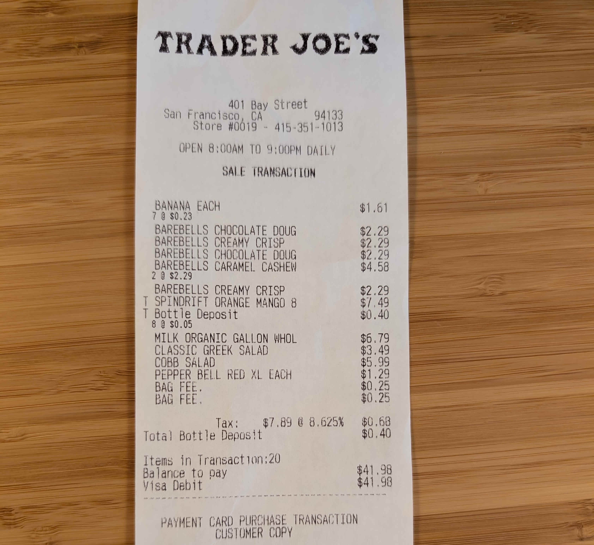

# Receipt Data Extraction with VLMs

## Setup

You'll need to install the dependencies:

```shell
pip install outlines torch==2.4.0 transformers accelerate pillow rich
```

## Import libraries

Load all the necessary libraries:

```python
# LLM stuff
import outlines
import torch
from transformers import AutoProcessor
from pydantic import BaseModel, Field
from typing import Literal, Optional, List

# Image stuff
from PIL import Image
import requests

# Rich for pretty printing
from rich import print
```

## Choose a model

This example has been tested with `mistral-community/pixtral-12b` ([HF link](https://huggingface.co/mistral-community/pixtral-12b)) and `Qwen/Qwen2-VL-7B-Instruct` ([HF link](https://huggingface.co/Qwen/Qwen2-VL-7B-Instruct)).

We recommend Qwen-2-VL as we have found it to be more accurate than Pixtral.

If you want to use Qwen-2-VL, you can do the following:

```python
# To use Qwen-2-VL:
from transformers import Qwen2VLForConditionalGeneration, AutoProcessor
model_name = "Qwen/Qwen2-VL-7B-Instruct"
model_class = Qwen2VLForConditionalGeneration
processor_class = AutoProcessor
```

If you want to use Pixtral, you can do the following:

```python
# To use Pixtral:
from transformers import LlavaForConditionalGeneration, LlavaProcessor
model_name="mistral-community/pixtral-12b"
model_class=LlavaForConditionalGeneration
processor_class = LlavaProcessor
```

## Load the model

Load the model into memory:

```python
model_kwargs={"device_map": "auto", "torch_dtype": torch.bfloat16}
processor_kwargs={"device_map": "cuda"}
tf_model = model_class.from_pretrained(model_name, **model_kwargs)
tf_processor = processor_class.from_pretrained(model_name, **processor_kwargs)

model = outlines.from_transformers(tf_model, tf_processor)
```

## Image processing

Images can be quite large. In GPU-poor environments, you may need to resize the image to a smaller size.

Here's a helper function to do that:

```python
def load_and_resize_image(image_path, max_size=1024):
    """
    Load and resize an image while maintaining aspect ratio

    Args:
        image_path: Path to the image file
        max_size: Maximum dimension (width or height) of the output image

    Returns:
        PIL Image: Resized image
    """
    image = Image.open(image_path)

    # Get current dimensions
    width, height = image.size

    # Calculate scaling factor
    scale = min(max_size / width, max_size / height)

    # Only resize if image is larger than max_size
    if scale < 1:
        new_width = int(width * scale)
        new_height = int(height * scale)
        image = image.resize((new_width, new_height), Image.Resampling.LANCZOS)

    return image
```

You can change the resolution of the image by changing the `max_size` argument. Small max sizes will make the image more blurry, but processing will be faster and require less memory.

## Load an image

Load an image and resize it. We've provided a sample image of a Trader Joe's receipt, but you can use any image you'd like.

Here's what the image looks like:



```python
# Path to the image
image_path = "https://raw.githubusercontent.com/dottxt-ai/outlines/refs/heads/main/docs/cookbook/images/trader-joes-receipt.jpg"

# Download the image
response = requests.get(image_path)
with open("receipt.png", "wb") as f:
    f.write(response.content)

# Load + resize the image
image = load_and_resize_image("receipt.png")
```

## Define the output structure

We'll define a Pydantic model to describe the data we want to extract from the image.

In our case, we want to extract the following information:

- The store name
- The store address
- The store number
- A list of items, including the name, quantity, price per unit, and total price
- The tax
- The total
- The date
- The payment method

Most fields are optional, as not all receipts contain all information.

```python
class Item(BaseModel):
    name: str
    quantity: Optional[int]
    price_per_unit: Optional[float]
    total_price: Optional[float]

class ReceiptSummary(BaseModel):
    store_name: str
    store_address: str
    store_number: Optional[int]
    items: List[Item]
    tax: Optional[float]
    total: Optional[float]
    # Date is in the format YYYY-MM-DD. We can apply a regex pattern to ensure it's formatted correctly.
    date: Optional[str] = Field(pattern=r'\d{4}-\d{2}-\d{2}', description="Date in the format YYYY-MM-DD")
    payment_method: Literal["cash", "credit", "debit", "check", "other"]
```

## Prepare the prompt

We'll use the `tf_processor` to convert the image and the text prompt into a format that the model can understand. Practically,
this is the code that adds user, system, assistant, and image tokens to the prompt.

```python
# Set up the content you want to send to the model
messages = [
    {
        "role": "user",
        "content": [
            {
                # The image is provided as a PIL Image object
                "type": "image",
                "image": image,
            },
            {
                "type": "text",
                "text": f"""You are an expert at extracting information from receipts.
                Please extract the information from the receipt. Be as detailed as possible --
                missing or misreporting information is a crime.

                Return the information in the following JSON schema:
                {ReceiptSummary.model_json_schema()}
            """},
        ],
    }
]

# Convert the messages to the final prompt
prompt = tf_processor.apply_chat_template(
    messages, tokenize=False, add_generation_prompt=True
)
```

If you are curious, the final prompt that is sent to the model looks (roughly) like this:

```
<|im_start|>system
You are a helpful assistant.<|im_end|>
<|im_start|>user
<|vision_start|><|image_pad|><|vision_end|>
You are an expert at extracting information from receipts.
Please extract the information from the receipt. Be as detailed as
possible -- missing or misreporting information is a crime.

Return the information in the following JSON schema:

<JSON SCHEMA OMITTED>
<|im_end|>
<|im_start|>assistant
```

## Run the model

```python
# Prepare a function to process receipts
receipt_summary_generator = outlines.Generator(model, ReceiptSummary)

# Generate the receipt summary
result = receipt_summary_generator(
    {"text": prompt, "images": image},
    max_new_tokens=1024
)
print(result)
```

## Output

The output should look like this:

```
{
  "store_name": "Trader Joe's",
  "store_address": "401 Bay Street, San Francisco, CA 94133",
  "store_number": 0,
  "items": [
    {"name": "BANANA EACH", "quantity": 7, "price_per_unit": 0.23, "total_price": 1.61},
    {"name": "BAREBELLS CHOCOLATE DOUG", "quantity": 1, "price_per_unit": 2.29, "total_price": 2.29},
    {"name": "BAREBELLS CREAMY CRISP", "quantity": 1, "price_per_unit": 2.29, "total_price": 2.29},
    {"name": "BAREBELLS CHOCOLATE DOUG", "quantity": 1, "price_per_unit": 2.29, "total_price": 2.29},
    {"name": "BAREBELLS CARAMEL CASHEW", "quantity": 2, "price_per_unit": 2.29, "total_price": 4.58},
    {"name": "BAREBELLS CREAMY CRISP", "quantity": 1, "price_per_unit": 2.29, "total_price": 2.29},
    {"name": "SPINDRIFT ORANGE MANGO 8", "quantity": 1, "price_per_unit": 7.49, "total_price": 7.49},
    {"name": "Bottle Deposit", "quantity": 8, "price_per_unit": 0.05, "total_price": 0.4},
    {"name": "MILK ORGANIC GALLON WHOL", "quantity": 1,"price_per_unit": 6.79,"total_price": 6.79},
    {"name": "CLASSIC GREEK SALAD", "quantity": 1, "price_per_unit": 3.49, "total_price": 3.49},
    {"name": "COBB SALAD", "quantity": 1, "price_per_unit": 5.99, "total_price": 5.99},
    {"name": "PEPPER BELL RED XL EACH", "quantity": 1, "price_per_unit": 1.29, "total_price": 1.29},
    {"name": "BAG FEE.", "quantity": 1, "price_per_unit": 0.25, "total_price": 0.25},
    {"name": "BAG FEE.", "quantity": 1, "price_per_unit": 0.25, "total_price": 0.25},
  ],
  "tax": 0.68,
  "total": 41.98,
  "date": "2023-11-04",
  "payment_method": "debit"
}
```

Voila! You've successfully extracted information from a receipt using an LLM.

## Bonus: roasting the user for their receipt

You can roast the user for their receipt by adding a `roast` field to the end of the  `ReceiptSummary` model.

```python
class ReceiptSummary(BaseModel):
    ...
    roast: str
```

which gives you a result like

```
{
    ...
    "roast": "You must be a fan of Trader Joe's because you bought enough
    items to fill a small grocery bag and still had to pay for a bag fee.
    Maybe you should start using reusable bags to save some money and the
    environment."
}
```

Qwen is not particularly funny, but worth a shot.
