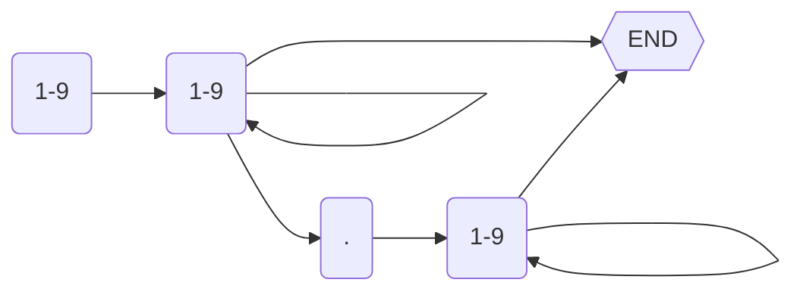
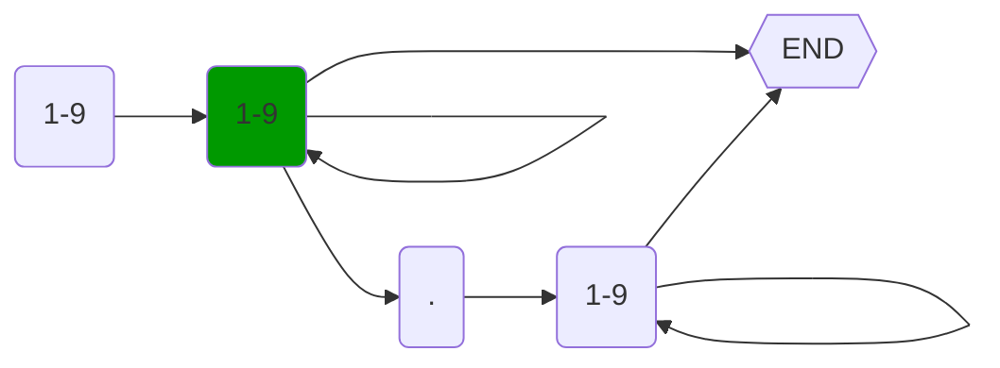
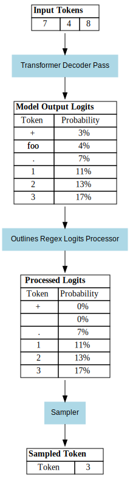

# How does Outlines work?

Language models generate text token by token, using the previous token sequence as input and sampled logits as output. This document explains the structured generation process, where only legal tokens are considered for the next step based on a predefined automata, e.g. a regex-defined [finite-state machine](https://en.wikipedia.org/wiki/Finite-state_machine) (FSM) or [Lark](https://lark-parser.readthedocs.io/en/stable/) grammar.`

## Worked Example

Let's consider a worked example with a pattern for whole and decimal numbers:

`^\d*(\.\d+)?$`.

### Creating Automata

The pattern is first converted into an automata. Below is a brief explanation of the automata conversion and its representation.

**Automata Diagram:**

### Generating a Token

Let's assume that we're in the middle of generation, and so far "748" has been generated. Here is the automata with the current state highlighted in green, with the legal next characters being another number (1-9), a dot (.), or end of sequence.

Generating a token requires the following steps:

- Feed the previous input sequence ("748") into the language model.
- Language model runs a forward pass and produces token logits.
- Outlines logits processor sets the probability of illegal tokens to 0%.
- A token is sampled from the set of legal tokens.

