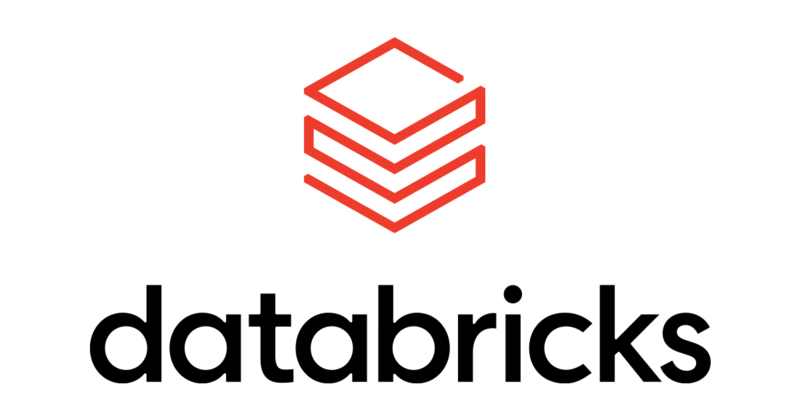
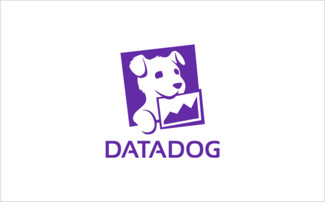
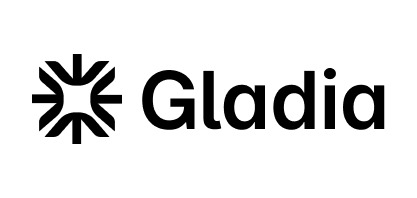

# Outlines

Outlines is a Python library from [.TXT](https://dottxt.co) that guarantees structured output from 
large language models. It ensures LLMs speak the language of your application by making them follow specific formats such as JSON, regular expressions, or context-free grammars.

[Get started](/docs/getting_started){ .md-button .md-button--primary }
[API Reference](/api/reference){ .md-button }
[Examples](/examples){ .md-button }
[GitHub](https://github.com/yourusername/outlines){ .md-button }

## Features

<div class="grid cards" markdown>

- :material-shield-check: __Reliable__ - Guaranteed schema compliance -- always valid JSON.
- :material-puzzle: __Feature-rich__ - Supports a large proportion of the JSON Schema spec, along with regex and context-free grammars.
- :material-lightning-bolt: __Fast__ - Outlines has negligible runtime overhead, and fast compilation times.
- :material-cog: __Universal__ - Outlines is a powered by Rust, and can be easily bound to other languages.
- :material-lightbulb: __Simple__ - Outlines is a low-abstraction library. Write code the way you normally do with LLMs. No agent frameworks needed.
- :material-magnify: __Powerful__ - Manage prompt complexity with prompt templating.

</div>

## Installation

We recommend using `uv` to install Outlines. You can find `uv` installation instructions [here](https://github.com/astral-sh/uv).

To install Outlines with the `transformers` backend, run:

```bash
uv pip install 'outlines[transformers]'
```

or the classic `pip`:

```bash
pip install 'outlines[transformers]'
```

For other backends, see the [installation guide](/installation).

## Quick start

Outlines wraps around a variety of LLM inference backends, described in the [installation guide](/installation). The following example shows how to use Outlines with HuggingFace's [`transformers` library](https://huggingface.co/docs/transformers/en/index).

=== "Transformers"

    ```python
    import outlines
    from transformers
    from pydantic import BaseModel

    # Define a Pydantic model describing the output format
    class Person(BaseModel):
        # Set name and age fields to string and int respectively
        name: str
        age: int

    # Create an Outlines model using transformers
    model_name = "HuggingFaceTB/SmolLM2-135M-Instruct"
    model = outlines.from_transformers(
        transformers.AutoModelForCausalLM.from_pretrained(model_name),
        transformers.AutoTokenizer.from_pretrained(model_name),
    )

    # Generate a response
    response = model("Create a character.", Person) # { "name": "John", "age": 30 }
    ```

=== "OpenAI"

    ```python
    import outlines
    from openai import OpenAI
    from pydantic import BaseModel

    # Define a Pydantic model describing the output format
    class Person(BaseModel):
        # Set name and age fields to string and int respectively
        name: str
        age: int

    # Create an OpenAI client instance
    openai_client = OpenAI()

    # Create an Outlines model 
    model = outlines.from_openai(openai_client, "gpt-4o")

    # Generate a response
    response = model("Create a character.", Person) # { "name": "John", "age": 30 }
    ```

=== "vLLM (offline)" 

    ```python
    import outlines
    from pydantic import BaseModel
    from vllm import LLM

    # Define a Pydantic model describing the output format
    class Person(BaseModel):
        # Set name and age fields to string and int respectively
        role: str
        age: int

    # Model to use, it will be downloaded from the HuggingFace hub
    model_id = "microsoft/Phi-3-mini-4k-instruct"

    # Create a vLLM model
    vllm_model = LLM(model_id)

    # Create an Outlines model
    model = outlines.from_vllm_offline(vllm_model)

    # Generate a response
    response = model("Create a character.", Person) # { "name": "John", "age": 30 }
    ```

=== "vLLM (online)"

    ```python
    import outlines
    from openai import OpenAI
    from pydantic import BaseModel

    # Define a Pydantic model describing the output format
    class Person(BaseModel):
        # Set name and age fields to string and int respectively
        name: str
        age: int

    # You must have a separete vLLM server running
    # Create an OpenAI client with the base URL of the VLLM server
    openai_client = OpenAI(base_url="http://localhost:11434/v1")

    # Specify the model available on the VLLM server to use
    model_id = "microsoft/Phi-3-mini-4k-instruct"

    # Create an Outlines model
    model = outlines.from_vllm(openai_client, model_id)

    # Generate a response
    response = model("Create a character.", Person) 
    # { "name": "John", "age": 30 }
    ```

=== "llama.cpp"

    ```python
    import outlines
    from llama_cpp import Llama
    from pydantic import BaseModel

    # Define a Pydantic model describing the output format
    class Person(BaseModel):
        # Set name and age fields to string and int respectively
        name: str
        age: int

    # Model to use, it will be downloaded from the HuggingFace hub
    repo_id = "TheBloke/Llama-2-13B-chat-GGUF"
    file_name = "llama-2-13b-chat.Q4_K_M.gguf"

    # Create a Llama.cpp model
    llama_cpp_model = Llama.from_pretrained(repo_id, file_name)

    # Create an Outlines model
    model = outlines.from_llamacpp(llama_cpp_model)

    # Generate a response
    response = model("Create a character.", Person) # { "name": "John", "age": 30 }
    ```

=== "Dottxt"

    ```python
    import outlines
    from dottxt.client import Dottxt
    from pydantic import BaseModel

    # Define a Pydantic model describing the output format
    class Person(BaseModel):
        # Set name and age fields to string and int respectively
        name: str
        age: int

    # Create an Dottxt client
    client = Dottxt()

    # Create an Outlines model 
    model = outlines.from_dottxt(client)

    # Generate a response
    response = model("Create a character.", Person) # { "name": "John", "age": 30 }
    ```

=== "Anthropic"

    ```python
    import outlines
    from anthropic import Anthropic
    from pydantic import BaseModel

    # Create an Anthropic client
    client = Anthropic()

    # Create an Outlines model 
    model = outlines.from_anthropic(client, "claude-3-haiku-20240307")

    # Generate a response
    response = model("Create a character.", max_tokens=20) # Here is a character I have created:\n\nName: Ayla Samara
    ```

=== "Ollama"

    ```python
    import outlines
    from ollama import Client
    from pydantic import BaseModel

    # Define a Pydantic model describing the output format
    class Person(BaseModel):
        # Set name and age fields to string and int respectively
        name: str
        age: int

    # Create an Ollama client
    client = Client()

    # Create an Outlines model, the model must be available on your system
    model = outlines.from_ollama(client, "tinyllama")

    # Generate a response
    response = model("Create a character.", Person) 
    # { "name": "John", "age": 30 }
    ```

=== "mlx-lm"

    ```python
    import outlines
    import mlx_lm
    from pydantic import BaseModel

    # Define a Pydantic model describing the output format
    class Person(BaseModel):
        # Set name and age fields to string and int respectively
        role: str
        age: int

    # Create an MLXLM model with the output of mlx_lm.load
    # The model will be downloaded from the HuggingFace hub
    model = outlines.from_mlxlm(mlx_lm.load(
        "mlx-community/SmolLM-135M-Instruct-4bit"
    ))

    # Generate a response
    response = model("Create a character.", Person) 
    # { "name": "John", "age": 30 }
    ```

=== "Gemini"

    ```python
    import outlines
    from google.generativeai import GenerativeModel
    from pydantic import BaseModel

    # Define a Pydantic model describing the output format
    class Person(BaseModel):
        # Set name and age fields to string and int respectively
        name: str
        age: int

    # Create a Gemini client
    client = GenerativeModel()

    # Create an Outlines model 
    model = outlines.from_gemini(client)

    # Generate a response
    response = model("Create a character.", Person) # { "name": "John", "age": 30 }
    ```

=== "SgLang"

    ```python
    # SgLang

    import outlines
    from openai import OpenAI
    from pydantic import BaseModel

    # Define a Pydantic model describing the output format
    class Person(BaseModel):
        # Set name and age fields to string and int respectively
        name: str
        age: int

    # You must have a separete SgLang server running
    # Create an OpenAI client with the base URL of the SgLang server
    openai_client = OpenAI(base_url="http://localhost:11434/v1")

    # Create an Outlines model
    model = outlines.from_sglang(openai_client)

    # Generate a response
    response = model("Create a character.", Person) # { "name": "John", "age": 30 }
    ```


### JSON

```python

# Define the input text
person_text = """
John Doe
30
john.doe@example.com
"""

# Apply chat templating to the input text
prompt = tokenizer.apply_chat_template(
    [
        {"role": "system", "content": """
        You are a master of extracting information from text.
        """},
        {"role": "user", "content": person_text}
    ],
    tokenize=False
)

# Generate the output
result = model(
    prompt, 
    Person,

    # Note: transformers has an extremely small default
    # max_new_tokens, which is often not enough for the 
    # full JSON output. You will experience errors if your 
    # model is unable to generate the full JSON output due
    # to the max_new_tokens limit.
    max_new_tokens=100
)

print(result)
```

Result:

```json
{
    "name": "John Doe",
    "age": 30,
    "email": "john.doe@example.com"
}
```

### Regex

> [!NOTE]
> Insert regex example here

### Multiple choice

> [!NOTE]
> Insert multiple choice example here

## Supported models

> [!NOTE]
> Provide full model list with links to docs about each model

- vLLM
- Transformers
- OpenAI


## About .txt

Outlines is built with ❤️ by [.txt](https://dottxt.co). 

.txt solves the critical problem of reliable structured output generation for large language models. Our commercially-licensed libraries ensure 100% compliance with JSON Schema, regular expressions and context-free grammars while adding only microseconds of latency. Unlike open-source alternatives, we offer superior reliability, performance, and enterprise support.


----------------------------- old

Outlines is a Python library that allows you to use Large Language Model in a simple and robust way (with structured generation). It is built by [.txt][.txt]{:target="_blank"}, and is already used in production by many companies.

## What models do you support?

We support [Openai](reference/models/openai.md), but the true power of Outlines is unleashed with Open Source models available via the [transformers](reference/models/transformers.md), [llama.cpp](reference/models/llamacpp.md), [mlx-lm](reference/models/mlxlm.md) and [vllm](reference/models/vllm.md) models. If you want to build and maintain an integration with another library, [get in touch][discord].

## What are the main features?

<div class="grid cards" markdown>
-   :material-code-json:{ .lg .middle } __Make LLMs generate valid JSON__

    ---

    No more invalid JSON outputs, 100% guaranteed

    [:octicons-arrow-right-24: Generate JSON](reference/generation/json.md)

-   :material-keyboard-outline:{ .lg .middle } __JSON mode for vLLM__

    ---

    Deploy a LLM service using Outlines' JSON structured generation and vLLM

    [:octicons-arrow-right-24: Deploy outlines](reference/serve/vllm.md)


-   :material-regex:{ .lg .middle } __Make LLMs follow a Regex__

    ---

    Generate text that parses correctly 100% of the time

    [:octicons-arrow-right-24: Guide LLMs](reference/generation/regex.md)

-    :material-chat-processing-outline:{ .lg .middle } __Powerful Prompt Templating__

     ---

     Better manage your prompts' complexity with prompt templating

    [:octicons-arrow-right-24: Learn more](reference/prompting.md)
</div>

## Why use Outlines?


Outlines is built at [.txt][.txt] by engineers with decades of experience in software engineering, machine learning (Bayesian Statistics and NLP), and compilers. [.txt][.txt] is a VC-backed company fully focused on the topic of structured generation and is committed to make the community benefit from its experience.

We are also open source veterans and have authored/maintained many libraries over the years: the [Aesara][aesara]{:target="_blank"} and [Pythological][pythological]{:target="_blank"} ecosystems, [Blackjax][blackjax]{:target="_blank"} and [Hy][hy]{:target="_blank"} among many others.
.

Outlines does not use unnecessary abstractions that tend to get in your way. We have a laser focus on reliable text generation with LLMs, a clear roadmap to push the state of the art in this area and a commitment to clean and robust code.

And last but not least, unlike alternatives, Outlines' structured generation introduces **no overhead** during inference.


## Who is using Outlines?

Hundreds of organisations and the main LLM serving frameworks ([vLLM][vllm], [TGI][tgi], [LoRAX][lorax], [xinference][xinference], [SGLang][sglang]) are using Outlines. Some of the prominent companies and organizations that are using Outlines include:

<head>
  <style>
  .row {
      display: inline-block;
      width: 100%;
      margin-bottom: 50px;
      margin-top: 0px !important;
      break-inside: avoid;
  }

  /* Create two equal columns that sits next to each other */
  .column {
      column-count: 3;
      column-gap: 20px;
      padding: 20px;
  }

  </style>
</head>
<body>

<div class="column">
  <div class="row"></div>
  <div class="row"></div>
  <div class="row"></div>
  <div class="row"></div>
  <div class="row"></div>
  <div class="row"></div>
  <div class="row"></div>
  <div class="row"></div>
  <div class="row"></div>
  <div class="row"></div>
  <div class="row"></div>
  <div class="row"></div>
  <div class="row"></div>
  <div class="row"></div>
  <div class="row"></div>
  <div class="row"></div>
  <div class="row"></div>
  <div class="row"></div>
  <div class="row"></div>
  <div class="row"></div>
  <div class="row"></div>
  <div class="row"></div>
  <div class="row"></div>
  <div class="row"></div>
  <div class="row"></div>
</div>

</body>

Organizations are included either because they use Outlines as a dependency in a public repository, or because of direct communication between members of the Outlines team and employees at these organizations.

Still not convinced, read [what people say about us](community/feedback.md). And make sure to take a look at what the [community is building](community/examples.md)!

## Philosophy

**Outlines**  is a library for neural text generation. You can think of it as a
more flexible replacement for the `generate` method in the
[transformers](https://github.com/huggingface/transformers) library.

**Outlines**  helps developers *structure text generation* to build robust
interfaces with external systems. It provides generation methods that
guarantee that the output will match a regular expressions, or follow
a JSON schema.

**Outlines**  provides *robust prompting primitives* that separate the prompting
from the execution logic and lead to simple implementations of few-shot
generations, ReAct, meta-prompting, agents, etc.

**Outlines**  is designed as a *library* that is meant to be compatible the
broader ecosystem, not to replace it. We use as few abstractions as possible,
and generation can be interleaved with control flow, conditionals, custom Python
functions and calls to other libraries.

**Outlines**  is *compatible with every auto-regressive model*. It only interfaces with models
via the next-token logits distribution.

## Outlines people

Outlines would not be what it is today without a community of dedicated developers:

<a href="https://github.com/dottxt-ai/outlines/graphs/contributors">
  
</a>

## Acknowledgements

<div class="grid" markdown>


<figure markdown>
  <a href="http://www.dottxt.co">
  { width="150" }
  </a>
</figure>

<figure markdown>
  <a href="https://www.normalcomputing.ai">
  { width="150" }
  </a>
</figure>

</div>

Outlines was originally developed at [@NormalComputing](https://twitter.com/NormalComputing) by [@remilouf](https://twitter.com/remilouf) and [@BrandonTWillard](https://twitter.com/BrandonTWillard). It is now maintained by [.txt](https://dottxt.co).


[discord]: https://discord.gg/R9DSu34mGd
[aesara]: https://github.com/aesara-devs
[blackjax]: https://github.com/blackjax-devs/blackjax
[pythological]: https://github.com/pythological
[hy]: https://hylang.org/
[.txt]: https://dottxt.co
[vllm]: https://github.com/vllm-project/vllm
[tgi]: https://github.com/huggingface/text-generation-inference
[lorax]: https://github.com/predibase/lorax
[xinference]: https://github.com/xorbitsai/inference
[sglang]: https://github.com/sgl-project/sglang/
